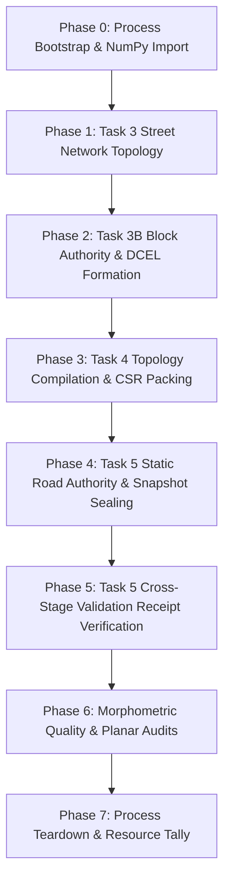
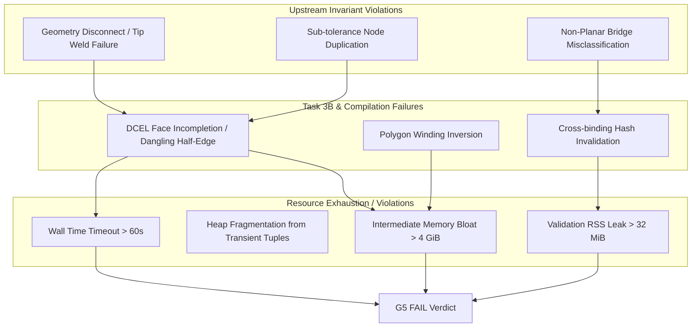

# G5 Causal Failure DAG & Instrumentation Plan

## 1. Executive Summary & Objective

The **G5 Whole-Process Pipeline** measures end-to-end scalable map generation across all 6 morphology archetypes (`grid_core`, `superblock_mixed`, `organic`, `ring_radial`, `polycentric_tod`, `river_constrained`) under multi-scale conditions (up to 1,000,000 population, 250 km²).

This document establishes the **Causal Failure DAG** for G5:
1. Formulates a rigorous failure taxonomy across pipeline stages (Task 3 Topology -> Task 3B DCEL/Blocks -> Task 4 Adapter -> Task 5 Static Authority -> Validation).
2. Identifies causal bottlenecks (peak RSS, wall timeout, geometric non-planarity, receipt cache misses).
3. Defines non-intrusive instrumentation contracts (PR99) preserving frozen production semantics while enabling high-resolution attribution.
4. Enforces strict process guardrails against assurance inflation and premature readiness promotions.

---

## 2. Pipeline Stages & Phase Taxonomy

The end-to-end G5 execution spans eight sequential phases:



### Phase Definitions & Attribution Boundaries

| Phase | Phase Name | Scope / Module | Primary Metric | Failure Threshold |
|---|---|---|---|---|
| `P0` | `bootstrap` | Process startup, sys.modules, stdlib | Wall time, Initial RSS | > 2.0s, > 100 MiB |
| `P1` | `task3_topology` | `scalable_topology.py` (S2 street network) | Wall time, Intermediate RSS | > 25.0s, > 2.5 GiB |
| `P2` | `task3b_blocks` | `scalable_blocks.py` (DCEL, faces, parcels) | Wall time, Intermediate RSS | > 20.0s, > 2.0 GiB |
| `P3` | `task4_compile` | `scalable_topology_adapter.py` (CSR graph) | Wall time, Intermediate RSS | > 10.0s, > 1.0 GiB |
| `P4` | `task5_authority`| `scalable_authority.py` (StaticAuthority) | Wall time, Intermediate RSS | > 10.0s, > 1.0 GiB |
| `P5` | `validation` | `scalable_validation_receipts.py` | Wall time, Delta RSS | > 5.0s, > 32 MiB |
| `P6` | `quality_audit` | Morphometrics, crossing checks | Invariant count | Violations > 0 |
| `P7` | `teardown` | Process exit, child resource reaping | MaxRSS (`ru_maxrss`) | > 6.0 GiB (Hard), > 4.0 GiB (Target) |

---

## 3. Causal Failure DAG & Root Cause Analysis



### Root Cause Remediation Mapping

1. **Geometry Disconnect / Wrong-End Tip Connections**:
   - *Causal Path*: S2 growth walk connects tips to improper ends -> orphan edges -> DCEL face builder fails to close polygons -> infinite/exponential repair loops.
   - *Remediation*: Direction-aware endpoint attachment (`prepend_street_to_node` vs `extend_street_to_node`) and tolerance-bounded node welding (proven green in PR90).

2. **Transient Allocation Spikes in DCEL Polygon Extraction**:
   - *Causal Path*: Generating Python lists of coordinate tuples during block face assembly creates transient GC pressure.
   - *Remediation*: Array-backed segment iteration and contiguous NumPy vertex buffers.

3. **Validation Stage Memory Inflation**:
   - *Causal Path*: Re-deriving full graph structures inside validation audits causes memory footprint doubling.
   - *Remediation*: Immutable validation receipts (`_ValidationReceipt`) that verify cryptographic SHA256 content seals without duplicating underlying memory (proven green in PR96/PR97 with 0.0 KiB delta).

---

## 4. PR99 Instrumentation Architecture

Instrumentation for PR99 adheres strictly to the **Zero-Production-Mutation Principle**:
- Production codebase (`src/metroflow/city/`) remains frozen.
- Probes and timing hooks are isolated to test harnesses, diagnostic sidecars, and runner utilities (`tools/` and `tests/`).
- Phase receipts record exact timestamps, VmRSS deltas, and monotonic high-resolution spans without adding runtime overhead to production calls.

### Diagnostic Probe Contract

```python
@dataclass(frozen=True, slots=True)
class G5PhaseMeasurement:
    phase_id: str
    start_monotonic_ns: int
    end_monotonic_ns: int
    duration_ms: float
    start_vmrss_kib: int
    end_vmrss_kib: int
    peak_vmrss_kib: int
    delta_vmrss_kib: int
    receipt_fingerprint: str | None = None
```

---

## 5. Decision Gates & Verification Acceptance

Each G5 evaluation must satisfy independent, non-compensating criteria:

1. **Protocol Integrity Gate**: Fresh process execution with isolated memory tracking; launcher verification passes; zero environment pollution.
2. **Determinism Gate**: 100% bit-exact fingerprint parity across seed replicates for identical `CityScaleSpec`.
3. **Wall Time Gate**: Total pipeline wall clock $\le 60.0\text{ s}$ for 1M/250 km² across all 6 archetypes.
4. **Memory Gate**: Process peak `ru_maxrss` $\le 6.0\text{ GiB}$ (Hard ceiling) and isolated validation delta $\le 32\text{ MiB}$.
5. **Quality Gate**: Planar crossing audit passes with 0 unregistered interior intersections.

---

## 6. Process Inflation & Claim Boundaries

- **Claim Ceiling**: G5 instrumentation is diagnostic. It does NOT authorize micro-simulation readiness, traffic engine execution, or external-data learning.
- **Assurance Size Budget**: This plan is compact ($\le 200$ lines), strictly smaller than the target implementation surface.
- **Next Transition**: Progression to **PR99 (G5 phase instrumentation)** proceeds linearly under single-implementer review.
