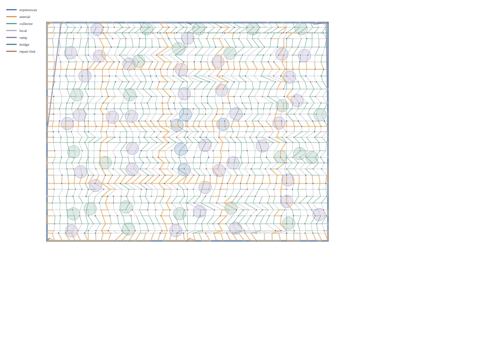
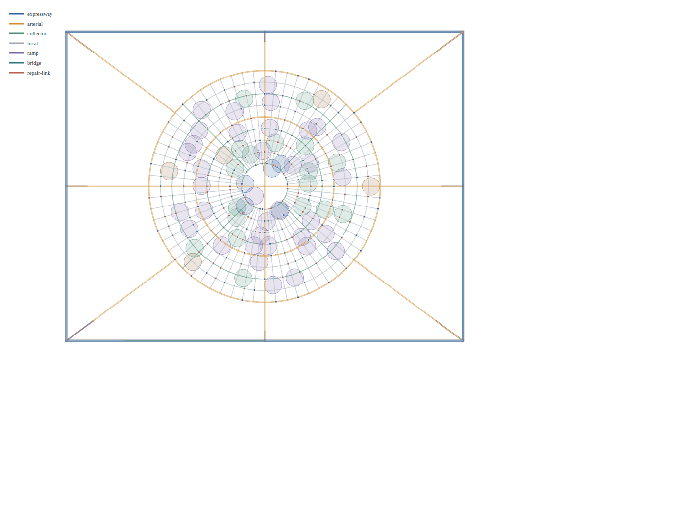
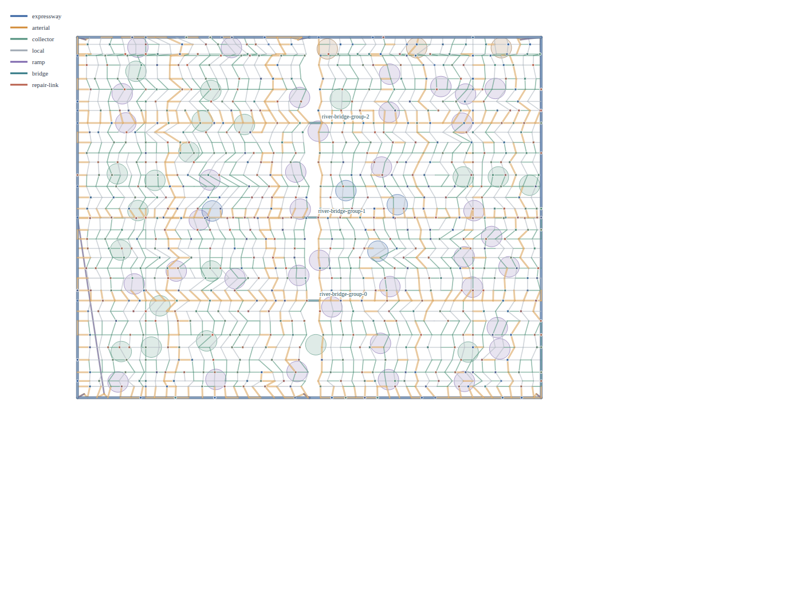
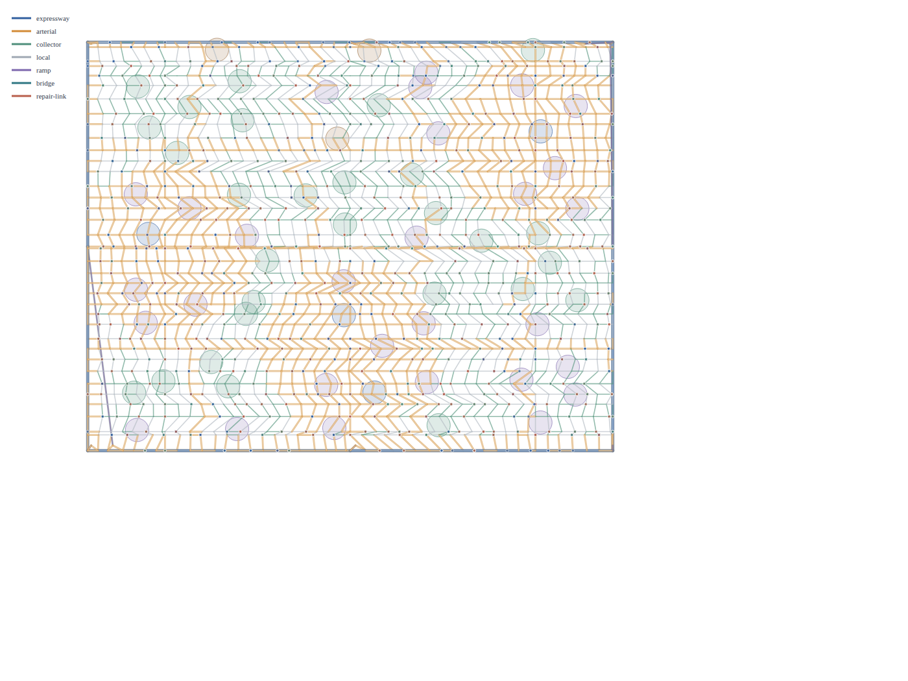
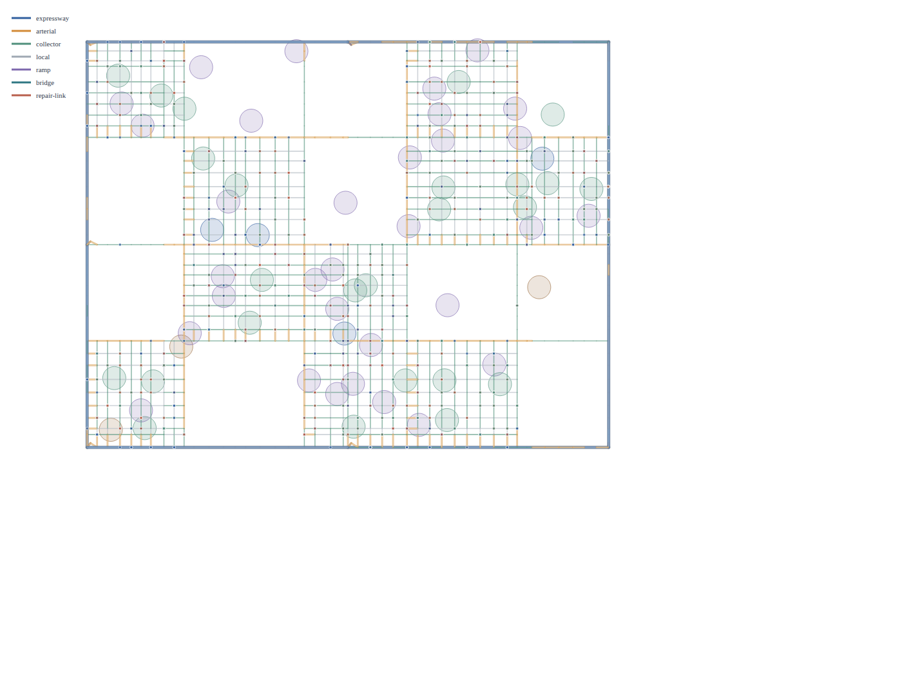
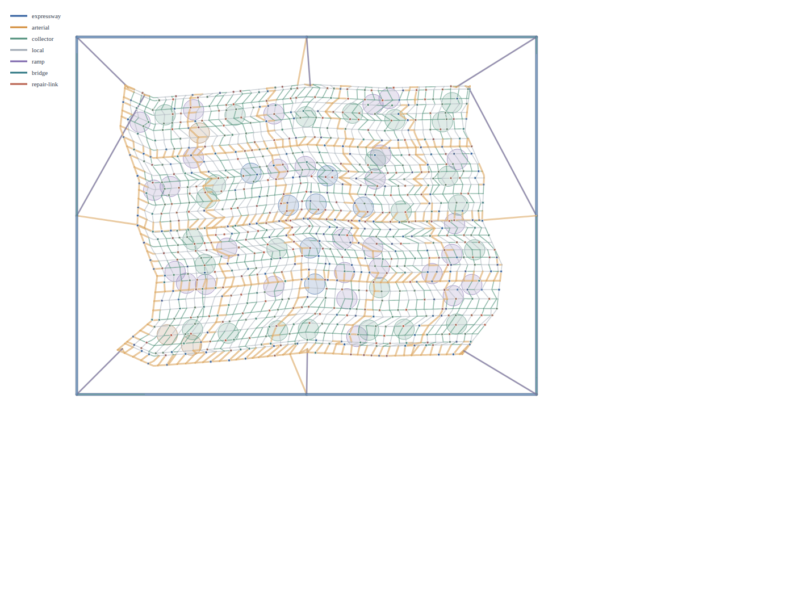
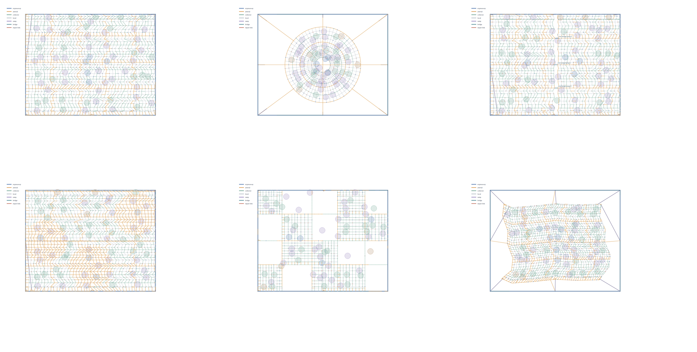

# MetroFlow Held-Out Morphology Adversarial Audit

**Report date:** 2026-08-23

**Map/measurement source:** `e1979df281ac25a24a82fdea725422310f7c6807` / tree `622dbe37790c5414141cd5d5531a2158aa56f7e5`

**Scientific fingerprint:** `84b2f3657b21c9cedd9fe7723b4edf99ac3f7514cf7128aff6c994ff9da253f1`

**Primary verdict:** **FAIL - 15/18 held-out cases passed**

## Executive decision

This package validates a bounded **seed-held-out structural morphology** protocol, not a complete city or traffic model. Five styles passed all three unseen seeds; `grid_core` failed its axis-alignment criterion on seeds 503, 701, and 907. The exact aggregate is **15/18**, with zero skipped attempts, so the protocol verdict is **FAIL**.

The result is **NOT fresh-OSM empirical validation**. It does not test named cities, held-out external road data, traffic flow, route choice, travel time, resilience, or land-use interaction. **traffic-functional validation was not completed**: the earlier development probe left one lastfailed witness and no durable result matrix. Consistent with the user's boundary, traffic algorithms are treated as research-incomplete and functionality - not completeness - is the next validation target. **runtime-default promotion remains blocked**.

Merged PR #17 is not invalidated: its structural implementation and evidence identity gates passed exact-head and synthetic-merge CI on the identical tree. The new failure narrows what can be said about grid_core under unseen seeds.

MetroFlow is **single-developer personal research code**. In this report, adversarial audit means **skeptical scientific and code review**, not a hostile-operator threat model. Hashes and manifests are compact reproducibility and accidental-corruption receipts; this package makes **no security or tamper-resistance claim**.

## Scope and frozen boundaries

Included: the six seed-503 sample maps below, all 18 measurements from three held-out seeds, the validator and manifests, exact source/harness/remote-CI receipts, and the complete scoped failure inventory MF-001 through MF-043.

Excluded by design: morphology or traffic source changes, post-result threshold changes, alternate seeds, traffic repair/rerun, new OSM downloads, empirical promotion, runtime-default changes, push, PR, merge, and external publication.

## Harness application

The two supplied v3.1.0 archives were read as methods, not as user requests. The coding harness supplied the finite acceptance/reproduction contract and separation of software, scientific, numerical, and reproducibility evidence. The research harness supplied evidence-before-narrative, claim audit, decision gate, adversarial review, and negative-result preservation. Neither archive was installed and the repository AGENTS.md was not replaced.

## Provenance and evidence identity

The maps and results name commit `e1979df281ac25a24a82fdea725422310f7c6807` and tree `622dbe37790c5414141cd5d5531a2158aa56f7e5`. PR #17 head `6d6e05630b718b50cf311aa127dfb2eeb8d8530f` has the same tree. GitHub push run 32564391135 and pull-request run 32564393072 both ended in successful final `ci gate` jobs before merge. This package records those facts as implementation evidence, not as empirical validation.

The results file has SHA-256 `f4e6a36b...c9057fd`; the sample manifest has `998af7fa...686aec3`; and the validator has `713820af...af9d7d1`. The package manifest binds complete hashes and byte sizes for every report file except itself.

The original validator is retained byte-for-byte, including its historical author paths, because its digest is part of the result. The adjacent portable reproducer accepts explicit repository/package paths, verifies source commit/tree, and treats byte-identical rederivation with scientific verdict FAIL as successful reproduction rather than a process failure.

## Protocol

The fixed matrix is 6 styles x 3 unseen seeds (503, 701, 907) at target population 100,000 and urbanized area 25.0 km2. Development seeds were 0, 1, 2, 3, 4, 17, 29, 42, and 101. Each case requires nonempty output, exact style identity, deterministic replay, and a style-specific direct structural falsifier. The protocol records 18 expected, 18 attempted, 18 scored, and 0 skipped.

Thresholds were frozen before observation: at least two concentric rings with radial CV below 0.01; at least three river bridges/failure groups; at least three polycentric centres; at least four superblocks with minor axis >=700,000 mm and aspect ratio <=2.5; and bent-connector share >0.9. The grid criterion is a Boolean structural classifier in the frozen validator.

## Results

| Style | Passed | Seeds | Verdict |
| --- | ---: | --- | --- |
| Grid Core | 0/3 | 503, 701, 907 | FAIL |
| Ring-Radial | 3/3 | 503, 701, 907 | PASS |
| River-Constrained | 3/3 | 503, 701, 907 | PASS |
| Polycentric TOD | 3/3 | 503, 701, 907 | PASS |
| Superblock Mixed | 3/3 | 503, 701, 907 | PASS |
| Curvilinear Warped Grid (organic compatibility ID) | 3/3 | 503, 701, 907 | PASS |

All 18 networks were nonempty, style-bound, and deterministic under the validator replay. That generic success cannot override the three direct grid failures.

## Style-by-style adversarial analysis

### Grid Core

All generic checks passed: networks were nonempty, style identity was bound, one centre was present, two semantic carrier axes existed, and deterministic replay held.

The claim-specific axis_aligned_grid_core check failed on every seed. Observed aligned shares were 54.436%, 54.751%, 54.560%.

The raw witnesses are internally surprising: semantic horizontal and vertical carrier counts sum to the carrier total, yet the independent axis-aligned count is much smaller. This may expose warped geometry, a semantic-to-geometric mismatch, or an over-strict classifier. The current evidence does not choose among them.

### Ring-Radial

Every seed contains multiple closed degree-2 orbital cycles with winding magnitude one and distinct mean radii.

Orbital counts are 9, 12, 11; maximum radial CV across the matrix is 1.059e-06.

This falsifies the former central-cross masquerade, but does not calibrate ring spacing or traffic resilience against real cities.

### River-Constrained

Each held-out network has two-sided centres, three bridge carriers, and three bridge failure groups.

The result establishes a deterministic structural bottleneck grammar. It does not establish evacuation performance or empirical bridge density.

### Polycentric TOD

Every case has three non-collinear centres, three nonempty geometric catchments, and all three expected centre-pair hierarchy paths.

The evidence supports geometric polycentricity. It does not measure transit service, independent demand basins, or functional accessibility concentration.

### Superblock Mixed

The three cases contain 6, 6, and 5 hierarchy-perimeter macrocells. The smallest qualifying minor axis is 968,732 mm and the largest reported aspect ratio is 1.260, defeating the former one-axis strip false positive.

Mode-specific internal access, circulation, walkability, and travel time remain unmeasured.

### Curvilinear Warped Grid (organic compatibility ID)

Bent-connector shares are 98.019%, 98.334%, 97.475%, all above the preregistered 90% threshold.

This validates a curvilinear warped-grid embedding only. The report does not claim organic topology, branching history, or empirical urban realism.

## Generated map samples

### Grid Core - seed 503

Raster preview: `maps/map_grid_core_s503.png`; SVG authority: `maps/map_grid_core_s503.svg`. PNG is digest-bound preview evidence; it was not independently rerendered in this report-only work unit.

### Ring-Radial - seed 503

Raster preview: `maps/map_ring_radial_s503.png`; SVG authority: `maps/map_ring_radial_s503.svg`. PNG is digest-bound preview evidence; it was not independently rerendered in this report-only work unit.

### River-Constrained - seed 503

Raster preview: `maps/map_river_constrained_s503.png`; SVG authority: `maps/map_river_constrained_s503.svg`. PNG is digest-bound preview evidence; it was not independently rerendered in this report-only work unit.

### Polycentric TOD - seed 503

Raster preview: `maps/map_polycentric_tod_s503.png`; SVG authority: `maps/map_polycentric_tod_s503.svg`. PNG is digest-bound preview evidence; it was not independently rerendered in this report-only work unit.

### Superblock Mixed - seed 503

Raster preview: `maps/map_superblock_mixed_s503.png`; SVG authority: `maps/map_superblock_mixed_s503.svg`. PNG is digest-bound preview evidence; it was not independently rerendered in this report-only work unit.

### Curvilinear Warped Grid (organic compatibility ID) - seed 503

Raster preview: `maps/map_organic_s503.png`; SVG authority: `maps/map_organic_s503.svg`. PNG is digest-bound preview evidence; it was not independently rerendered in this report-only work unit.

### Six-map contact sheet

The visual atlas is for navigation and qualitative attack. Scientific acceptance comes from frozen source, exact fingerprints, and falsifiable measurements, not visual plausibility.

## Failure history synthesis

The mechanical inventory contains 43 unique records: 15 CLOSED, 2 PARTIALLY_CLOSED, 15 OPEN, 7 NEGATIVE_RESULT, 3 NOT_EVALUATED, and 1 CONTESTED. It begins with MF-001 (legacy gallery provenance), preserves MF-036 (the incomplete traffic-functional probe), and ends with MF-043 (a gate rejecting all five real controls).

Closed findings remain in the package because an external auditor must be able to reconstruct why later assurance exists. Open and negative findings are not diluted by the number of closed items. See `FAILURE_INVENTORY.md` and machine-readable `FAILURE_INVENTORY.json` for every impact, evidence source, resolution, remaining gate, and claim effect.

The most important retained blockers are MF-014 (no scalable_v2 arm in the v4 empirical table), MF-026/MF-032 (metric-envelope insufficiency), MF-033 and MF-034 (grid failure and unresolved cause), MF-035 (no fresh external holdout), MF-036 (traffic-functional validation not completed), and MF-037..MF-043 (canonical-ledger control, measurement, historical-replay, river, bypass, and gate failures).

## Traffic-functional negative result

The prior bounded traffic worktree contains draft source/test files and a pytest `lastfailed` key for `test_development_seed_traffic_probe_is_nonvacuous_and_directional`. There is no durable JSON/Markdown result, no complete fixed matrix, and no accepted cache-invalidation witness. This report therefore records a NEGATIVE_RESULT, not an algorithm diagnosis and not a validation result. The experiment was deliberately not rerun or repaired after the user narrowed this deliverable to held-out morphology reporting.

A future functional protocol should test nonvacuity, conservation, explicit units, immutable state transition, deterministic replay, cache invalidation, baseline fallback, directional response, and bounded performance. Passing those probes would establish bounded functionality only, not completeness.

## Scientific claim ceiling

Supported: source-bound deterministic generation; direct structural differentiation for five styles across three unseen seeds; exact disclosure of the grid negative result; and PR #17 implementation/CI provenance.

Unsupported: real-city distributional fit, held-out OSM generalization, traffic performance, route-choice validity, resilience, accessibility or land-use validity, functional TOD/superblocks, organic topology, algorithm completeness, and runtime-default promotion.

## External auditor attack plan

1. Run the package checker and focused behavior test without modifying artifacts.
2. Recompute every manifest hash and compare PNG dimensions and SVG digests.
3. Inspect the validator before the results; confirm the frozen seed split and thresholds.
4. Recalculate the 15/18 partition and attack the grid classifier construct independently.
5. Verify PR #17 run IDs/tree identity without treating CI as scientific evidence.
6. Search all prose for forbidden promotion language and reconcile every MF identifier.
7. Treat the contact sheet as navigation only; use source/fingerprint evidence for identity.

## Decision gate

**Artifact/report package:** admissible when its checker, focused tests, PDF text extraction, rendered-page inspection, and independent read-only review pass.

**Held-out morphology protocol:** **FAIL (15/18)**. Five style contracts generalized across the three seeds; grid_core did not.

**Empirical/scientific promotion:** **BLOCKED** pending fresh external data, non-vacuous morphology discriminators, and resolution of the grid construct.

**Traffic-functional validation:** **NOT COMPLETED / NEGATIVE_RESULT**. Future work should validate bounded functionality while explicitly retaining the premise that the traffic algorithms require further change and research.

**Runtime-default promotion:** **BLOCKED**.

## Appendix A - complete failure index

Every scoped failure appears below; `FAILURE_INVENTORY.md` supplies the full impact, evidence, resolution, and remaining-gate narrative.

| ID | State | Finding | Claim effect |
| --- | --- | --- | --- |
| MF-001 | CLOSED | Legacy gallery used the wrong generator/provenance label | Current six-map sample identity is admissible; legacy gallery claims remain historical only. |
| MF-002 | CLOSED | Gallery accepted score and geometry with a plus/minus ten-node mismatch | The former score-to-shape false-pass path is closed for current artifacts. |
| MF-003 | PARTIALLY_CLOSED | CI dependencies and tool versions were not frozen | Resolver/toolchain reproducibility is supported, but whole-image bit hermeticity is not. |
| MF-004 | OPEN | GitHub-hosted runner and wheels are not bit-hermetic | CI evidence is exact-head functional evidence, not a bit-hermetic build claim. |
| MF-005 | CLOSED | Node-to-TAZ assignment allowed float-to-millimetre reconstruction | The current Node-to-TAZ internal exact-mm contract is closed. |
| MF-006 | CLOSED | Project-state documentation was stale | Current report does not inherit a predecessor receipt without an explicit identity link. |
| MF-007 | CLOSED | Ring-radial style was a grid with a central cross | Structural ring-radial differentiation is validated; empirical realism is not. |
| MF-008 | CLOSED | Polycentric centres were collinear | Geometric polycentricity is validated, not functional TOD behaviour. |
| MF-009 | NOT_EVALUATED | Polycentric functional independence and transit concentration are untested | Functional polycentricity remains NOT_EVALUATED. |
| MF-010 | CLOSED | Superblock implementation produced one-axis elongated strips | The structural macroblock claim is closed within the current deterministic grammar. |
| MF-011 | NOT_EVALUATED | Superblock access, circulation, and mode function are unvalidated | Functional superblock validity remains NOT_EVALUATED. |
| MF-012 | CLOSED | Organic topology claim exceeded a warped-grid implementation | Curvilinear geometry is validated; organic street-network topology is not claimed. |
| MF-013 | CLOSED | Morphology semantic tests used weak proxy statistics | The six current structural labels have direct tests at their stated claim level. |
| MF-014 | OPEN | The v4 control table does not score scalable_synthetic_v2 | The present 15/18 seed result is structural only and not empirical control-table validation. |
| MF-015 | CLOSED | Full v4 artifact and manifest were not rederived in CI | Same-head v4 artifact reproducibility is closed for the PR #17 tree. |
| MF-016 | CLOSED | Score identity omitted or made optional source/spec fields | Current v4 score identity binds both source topology and measurement specification. |
| MF-017 | OPEN | PNG previews are digest-bound but not source-rerendered | PNG maps in this package are navigational previews; SVG/source fingerprints carry scientific identity. |
| MF-018 | CLOSED | Exact branch-head external CI was initially unavailable | PR #17 remote implementation evidence is closed; it does not validate this later report branch remotely. |
| MF-019 | CLOSED | Duplicate score keys could inflate summaries and overwrite diagnostics | The duplicate-key evidence-normalization path is closed. |
| MF-020 | CLOSED | Catch-all exceptions could be normalized as skipped cases | Unexpected program failures can no longer silently become normal skips in this collector. |
| MF-021 | CLOSED | Validation ledger contradicted live remote verification | The PR #17 ledger contradiction is closed. |
| MF-022 | OPEN | Unknown control-table schema names bypass current identity guards | Unknown-schema inputs are not covered by the v4 identity claim. |
| MF-023 | OPEN | Standard supported-style capability has a duplicated source of truth | The current matrix is correct, but future capability drift remains possible. |
| MF-024 | OPEN | SkippedCase reason_code remains a free string | Current receipts are trustworthy; the type-level future extension boundary remains open. |
| MF-025 | OPEN | Validation ledger local test count labels a predecessor head | Do not use the 1,473 count as a current-tree full-suite receipt. |
| MF-026 | OPEN | Seven-metric envelope admits a morphology null operator | Passing the v4 metric envelope is not sufficient evidence of urban realism. |
| MF-027 | OPEN | orientation_order is vacuous in the current empirical envelope | orientation_order does not support a morphology-validity claim. |
| MF-028 | OPEN | Geometry/topology diagnostics are reported but not gated | Reported diagnostics cannot be treated as passed scientific criteria. |
| MF-029 | NEGATIVE_RESULT | realistic_synthetic_v1 passed zero of 30 morphology cases | The PR62 empirical morphology promotion claim is rejected. |
| MF-030 | NEGATIVE_RESULT | realistic_synthetic_v1 failed 100k generation and throughput gates | Runtime-default promotion remains blocked. |
| MF-031 | OPEN | spacing_scale 3.0 was fitted to a repaired bug rather than rederived | No scientific inference may rely on spacing_scale 3.0 as a validated calibration. |
| MF-032 | OPEN | The control table lacks a block-size discriminator | The present empirical envelope is incomplete for block morphology. |
| MF-033 | NEGATIVE_RESULT | Held-out grid_core failed the axis-alignment contract in all three seeds | The grid_core held-out structural claim is a NEGATIVE_RESULT. |
| MF-034 | CONTESTED | Grid-core failure has unresolved construct-validity ambiguity | Cause is CONTESTED; neither generator defect nor invalid test is established by this result alone. |
| MF-035 | NOT_EVALUATED | Held-out validation is seed-only, not fresh OSM or named-city validation | This is NOT fresh-OSM empirical validation. |
| MF-036 | NEGATIVE_RESULT | Traffic-functional development probe did not reach a valid result | Traffic-functional validation was not completed; traffic algorithms remain research-incomplete and no completeness claim is permitted. |
| MF-037 | OPEN | OSM controls are a leaked development set with a different sampled population | Existing OSM-control agreement cannot support held-out empirical generalization. |
| MF-038 | OPEN | The default strict OSM importer rejects six of seven control extracts | OSM-control coverage cannot be attributed to the default importer without qualification. |
| MF-039 | PARTIALLY_CLOSED | Historical morphology metrics mixed measurement definitions and depended on representation | Current v4 parity is supported, but morphology statistics are not representation-invariant or interchangeable with historical tables. |
| MF-040 | OPEN | A historical control-table artifact cannot reproduce at its introducing commit | The historical table is evidence of a recorded result, not same-commit reproducibility. |
| MF-041 | NEGATIVE_RESULT | Legacy growth-fabric river-constrained maps were severed by the river | Legacy river connectivity claims are rejected even though the current scalable grammar passes its bounded bridge test. |
| MF-042 | NEGATIVE_RESULT | Legacy growth-fabric bypass did not exist as a network function | No bypass-function or congestion-relief inference is permitted from the historical maps. |
| MF-043 | NEGATIVE_RESULT | The morphology_quality gate rejected all five of its real controls | A generator pass or failure under morphology_quality cannot establish real-city quality until the gate admits its intended controls. |
