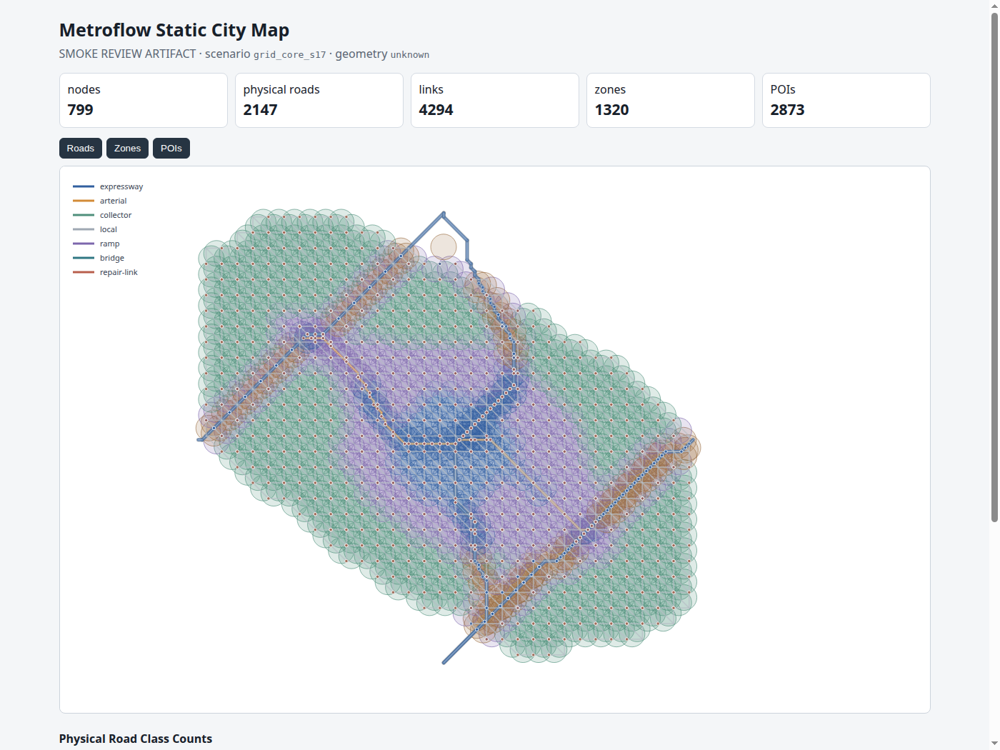
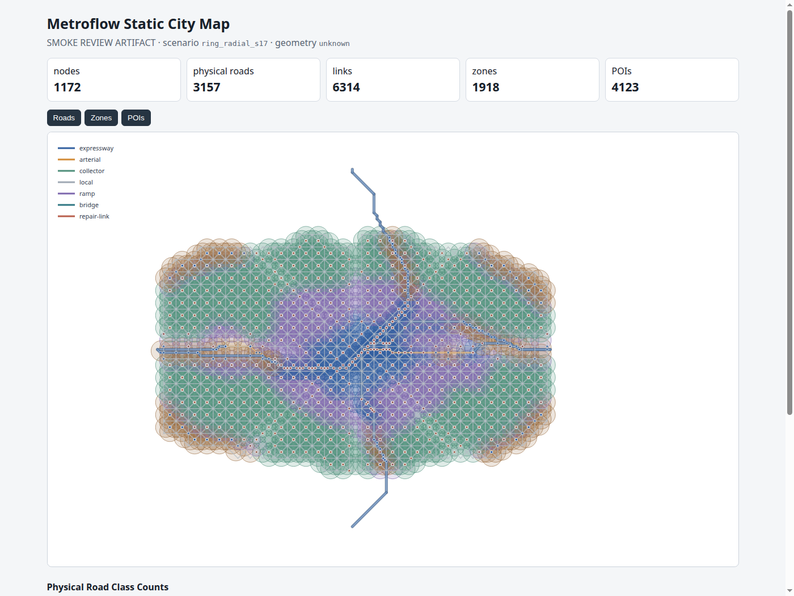
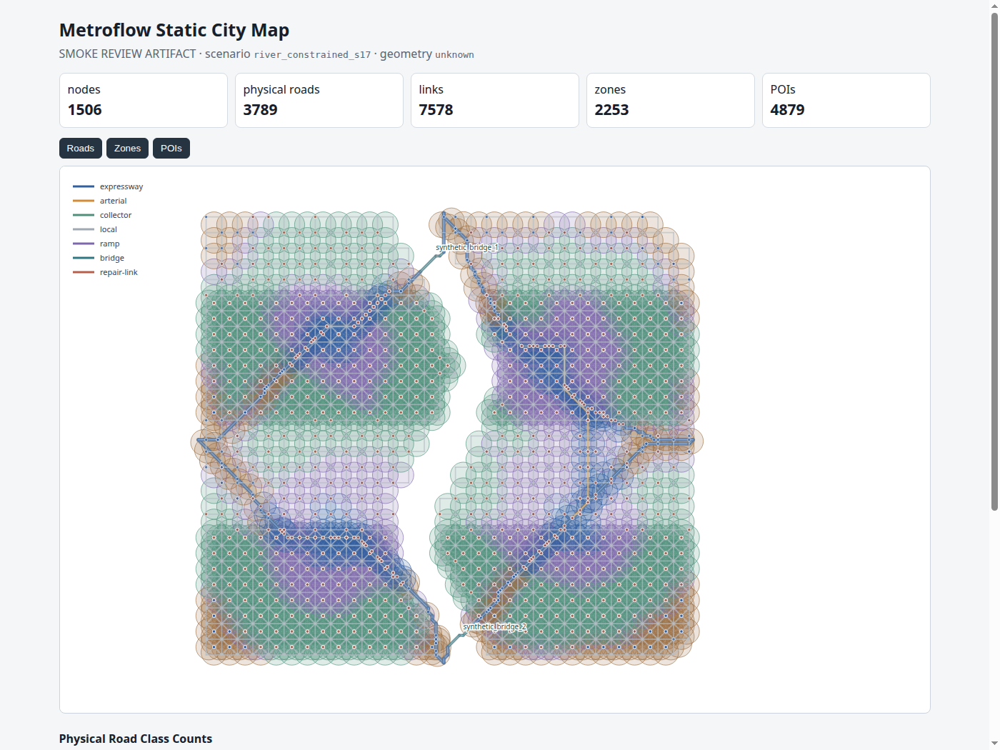
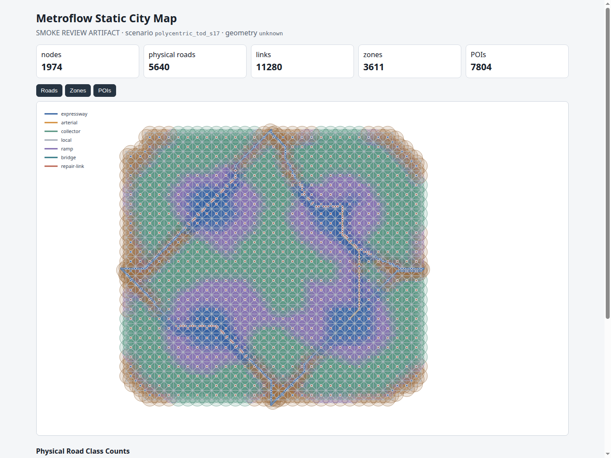
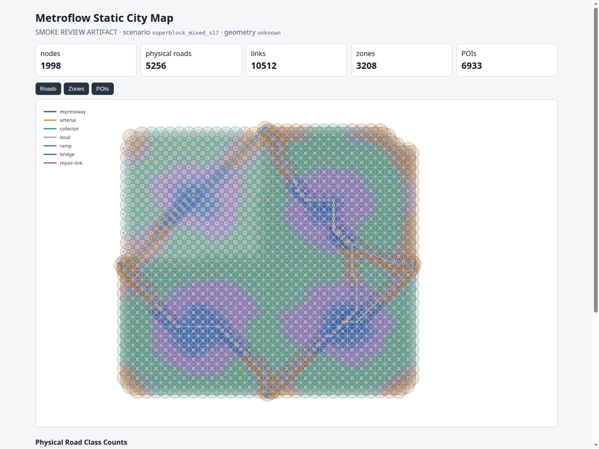
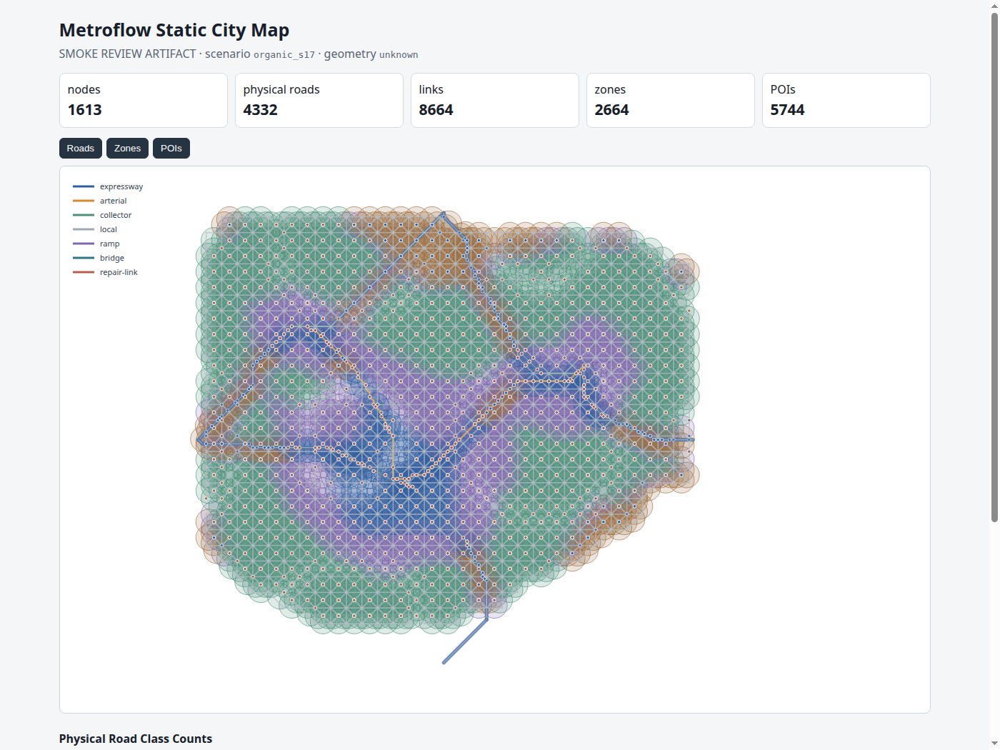

# MetroFlow Urban Morphology Sample Maps Gallery

This gallery contains rendered static map review artifacts for the **6 Urban Morphology Archetypes** generated by MetroFlow's realistic city generation pipeline.

Each map visualizes:
- **Road Hierarchy**: Expressways (blue), Arterials (orange), Collectors (teal), Local roads (gray), Ramps (purple), Bridge spans (cyan).
- **Physical Road Structures**: Width-aware ribbon shoulders, medians, and lane counts.
- **Topological Features**: Waterway boundaries and multi-span bridges (`river_constrained`), radial corridors (`ring_radial`), orthogonal grids (`grid_core`), transit centers (`polycentric_tod`), superblock perimeters (`superblock_mixed`), and organic networks (`organic`).
- **Land Use & POI Distribution**: Residential, commercial, and industrial block zoning with coupled transit / activity POIs.

---

## 1. Gridiron Core (`grid_core`)
Dense orthogonal Manhattan grid with diagonal arterial corridors.



- **Nodes**: 799
- **Physical Roads**: 2,147
- **Links**: 4,294
- **Zones**: 1,320
- **POIs**: 2,873

---

## 2. Ring Radial (`ring_radial`)
Concentric orbital rings intersecting radiating spine arterials.



- **Nodes**: 1,172
- **Physical Roads**: 3,157
- **Links**: 6,314
- **Zones**: 1,918
- **POIs**: 4,123

---

## 3. River Constrained (`river_constrained`)
Bifurcated city with distinct river corridor and structural bridge connections (`synthetic_bridge_1`, `synthetic_bridge_2`).



- **Nodes**: 1,506
- **Physical Roads**: 3,789
- **Links**: 7,578
- **Zones**: 2,253
- **POIs**: 4,879

---

## 4. Polycentric TOD (`polycentric_tod`)
Multi-hub polycentric layout connecting 4 dense transit-oriented activity clusters.



- **Nodes**: 1,974
- **Physical Roads**: 5,640
- **Links**: 11,280
- **Zones**: 3,611
- **POIs**: 7,804

---

## 5. Superblock Mixed (`superblock_mixed`)
High-capacity exterior arterial perimeter with low-speed pedestrian-priority interior blocks.



---

## 6. Organic Fabric (`organic`)
Topography-adapted curvilinear street network.



---

## Reproduction
To regenerate these artifacts from source:

```bash
PYTHONPATH=src .venv/bin/python tools/render_morphology_gallery.py --out artifacts/sample_city_maps
```
