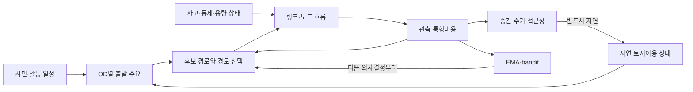

# MetroFlow 교통 시뮬레이션 최종 수학·물리 설계 및 구현 스펙

상태: **최종 통합 설계 규격 — 코드 구현 현황 문서가 아님**  
적용 범위: 교통 수요, 링크 통행, 노드 흐름, 경로 선택, 재탐색, 접근성,
토지이용 피드백, 제한적 온라인 적응  
기본 원칙: 보존성, 명시적 단위, 결정론적 재현, 지연 피드백, 기준 경로
fallback

## 1. 문서 목적과 권위

이 문서는 흩어져 있는 최종 설계 요구를 하나의 수학적·물리적 모델로
통합한다. 따라서 “현재 코드가 이렇게 동작한다”는 설명이 아니라, 구현이
만족해야 할 **목표 모델과 검증 가능한 계약**을 정의한다.

권위 우선순위는 다음과 같다.

1. [MetroFlow Constitution](../.specify/memory/constitution.md)
2. 기능별 최종 스펙과 계약
   - [001 MetroFlow baseline](../specs/001-metroflow/spec.md)
   - [WorldState contract](../specs/001-metroflow/contracts/WORLD_STATE_CONTRACT.md)
   - [Scheduler contract](../specs/001-metroflow/contracts/SCHEDULER_CONTRACT.md)
   - [Routing contract](../specs/001-metroflow/contracts/ROUTING_CONTRACT.md)
   - [Accessibility/Land-use contract](../specs/001-metroflow/contracts/ACCESSIBILITY_LANDUSE_CONTRACT.md)
   - [004 multirate orchestration](../specs/004-multirate-orchestration/spec.md)
   - [007 routing realism](../specs/007-routing-realism/spec.md)
   - [008 routing runtime integration](../specs/008-routing-runtime-integration/spec.md)
   - [061 physical link traversal](../specs/061-spatial-queue-runtime/spec.md)
3. 이 통합 문서
4. 상위 수준의 설명 문서
   - [PRD](PRD.md)
   - [TDD/SDD master spec](TDD_SDD_MASTER_SPEC.md)
   - [Traffic dynamics design](TRAFFIC_DYNAMICS_DESIGN.md)
   - [Routing and learning design](ROUTING_AND_LEARNING_DESIGN.md)
   - [Pseudocode compendium](PSEUDOCODE_COMPENDIUM.md)

기능별 스펙과 이 문서가 충돌하면 기능별 스펙이 우선한다. 이 문서에서
기존 스펙의 빈틈을 메우기 위해 추가한 세부식은 `SPECIFIED (통합 규격)`으로
취급하며, 구현 완료나 실증 검증을 뜻하지 않는다.

규범 용어는 다음 의미를 갖는다.

- **MUST**: 구현과 검증에서 반드시 만족해야 한다.
- **SHOULD**: 특별한 반증이나 별도 스펙이 없으면 따라야 한다.
- **MAY**: 명시적으로 선택 가능한 확장이다.

## 2. 모델이 말하는 “실제적”과 “지능적”의 범위

이 설계에서 실제적이라는 말은 다음 구조가 있다는 뜻이다.

- 차량 수 보존
- 링크 길이와 속도에 따른 유한한 통행 시간
- 차로 길이와 정체 간격에 따른 유한 저장량
- 하류 저장 공간 부족에 따른 spillback
- 용량 감소, 폐쇄, 사고에 따른 방출량 변화
- 관측된 혼잡 비용에 반응하는 경로 변경
- 평일/주말과 시간대에 따른 수요 변화
- 접근성 변화가 느린 토지이용·수요 구조에 지연되어 반영되는 구조

지능적이라는 말은 다음의 **설명 가능한 적응**을 뜻한다.

- 복수 후보 경로 비교
- 경로 중복을 벌점화하는 path-size 보정
- 사고와 ETA 악화에 대한 조건부 재탐색
- 여행자 행동 프로필의 비용 민감도·관성·탐색성 차이
- 시뮬레이터 내부 경험만 사용하는 EMA/bandit 적응
- 모든 적응이 실패할 때 결정론적 기준 경로로 되돌아가는 fallback

다음 주장은 이 문서만으로는 허용되지 않는다.

- 실측 도시의 교통량 또는 통행시간을 재현했다는 주장
- 보정된 fundamental diagram 또는 충격파 속도를 갖는다는 주장
- lane changing, car following, 신호현시 최적화를 구현했다는 주장
- 학습 모델이 경로 적법성이나 상태 변경 권위를 갖는다는 주장
- smoke test나 시각화만으로 교통 과학적 타당성이 검증됐다는 주장

## 3. 전체 인과 구조



핵심은 닫힌 고리가 존재하되 같은 tick 안에서 즉시 닫히지 않는다는 점이다.
혼잡은 다음 경로 판단에 영향을 주고, 접근성은 훨씬 느린 토지이용 갱신에
영향을 주며, 토지이용은 이후 수요 구조에만 영향을 준다.

## 4. 기호, 단위, 상태 분류

### 4.1 인덱스

| 기호 | 의미 |
|---|---|
| \(n\) | fast tick 인덱스 |
| \(e,f\) | 방향성 링크 |
| \(v\) | 그래프 노드 |
| \(m=(e,f)\) | 링크 \(e\)에서 \(f\)로 가는 허용 회전 |
| \(a\) | active trip 또는 차량 agent |
| \(i,j\) | 존(zone) |
| \(k\) | OD 후보 경로 |
| \(\sigma\) | 여행자 행동 프로필 |

### 4.2 기본 단위

| 물리량 | 기호 | 단위 | 분류 |
|---|---:|---:|---|
| fast tick 길이 | \(\Delta t\) | s/tick | 고정 입력 |
| 링크 길이 | \(L_e\) | m | 정적 |
| 자유류 속도 | \(v_e^0\) | m/s | 정적 |
| 링크 stock | \(N_e^n\) | veh | 상태 stock |
| 출구 대기 차량 | \(Q_e^n\) | veh | 상태 stock, \(Q_e^n\le N_e^n\) |
| 용량률 | \(\hat C_e^n\) | veh/s | rate |
| tick 용량 | \(C_e^n=\hat C_e^n\Delta t\) | veh/tick | tick increment |
| 회전 흐름 | \(Y_{ef}^n\) | veh/tick | 실현 increment |
| 링크 통행시간 | \(\tau_e^n\) | s | 비용 |
| 경로 비용 | \(C_k^n\) | s | 비용 |
| agent 진행도 | \(p_a^n\) | 1 | 무차원 상태 |
| 링크 저장량 | \(K_e\) | veh | 정적 또는 버전 상태 |
| 접근성 신호 | \(A_i\) | 1/s 또는 정규화 시 1 | 느린 상태 |
| 주거·일자리 용량 | \(H_i,J_i\) | count | 느린 stock |

코드 또는 저장 형식이 용량을 `veh/tick`으로 보유하더라도 물리적 입력이
`veh/s`라면 변환 \(C_e^n=\hat C_e^n\Delta t\)를 업데이트 경계에서 명시해야
한다. rate와 per-tick increment를 같은 필드에서 암묵적으로 섞으면 안 된다.

### 4.3 상태 불변조건

모든 수용 가능한 상태는 다음을 만족해야 한다.

\[
N_e^n\ge 0,\qquad 0\le Q_e^n\le N_e^n\le K_e
\]

\[
Y_{ef}^n\ge 0,\qquad
\sum_f Y_{ef}^n+Y_{e\to\mathrm{sink}}^n\le S_e^n
\]

\[
\sum_e Y_{ef}^n\le R_f^n
\]

차량 단위의 runtime authority가 정수이면 \(N,Q,Y,K\)는 정수여야 한다.
연속 용량 계산에서 생기는 소수부는 버리지 않고 §8.3의 잔차 상태로
이월한다.

## 5. 상태 소유권, 불변성, 버전

최상위 상태는 다음의 논리적 구획을 갖는다.

- `graph`: 노드, 링크, 회전 적법성, 링크 물리 속성, graph version
- `traffic`: 링크 stock/queue, 회전 상태, 비용 관측값
- `demand`: 시민, 일정, pending trip, active trip
- `routing`: 후보 경로, cost-to-go, 재탐색 cooldown
- `accessibility`: 존간 비용 스냅샷과 생성 시점·버전
- `landuse`: 주거·일자리 용량과 land-use version
- `policy`: EMA/bandit 상태와 policy version
- `replay`: seed, 통제 journal, 상태 fingerprint

업데이트는 입력 상태를 직접 변경하지 않고 새 상태를 반환해야 한다.
배열을 사용하더라도 외부 경계에서 읽기 전용으로 고정하거나 복사 소유권을
명확히 해야 한다.

### 5.1 캐시 무효화 규칙

| 변화 | 반드시 무효화할 캐시 |
|---|---|
| 그래프/회전 적법성/링크 ID 변화 | 모든 경로 후보, dynamic potential, 접근성 |
| 링크 비용 epoch 변화 | 비용 의존 potential과 경로 점수 |
| 사고·폐쇄 generation 변화 | 영향받는 destination potential과 경로 점수 |
| 토지이용 version 변화 | 접근성 및 토지이용 기반 OD 수요 |
| policy version 변화 | adaptive score만; 그래프 적법성 캐시는 유지 |

경로 캐시 키는 적어도 다음을 포함해야 한다.

\[
(\text{graph version},\ \text{turn version},\ d,\
\text{cost epoch},\ \text{event generation},\ \text{policy version})
\]

후보 경로의 **기하·적법성 부분**과 비용 점수 부분은 분리할 수 있다.
그래프가 같고 비용만 변했다면 후보 기하를 재사용할 수 있지만, 점수와
선택 결과는 다시 계산해야 한다.

## 6. 멀티레이트 시간 구조

### 6.1 cadence

fast, medium, slow 주기를 각각 \(N_f,N_m,N_s\) tick으로 둔다.
일반적으로 \(N_f=1\)이고

\[
N_f\le N_m\le N_s
\]

를 만족한다. 실행 여부는 pre-call tick \(n\)에서 결정한다.

\[
I_x(n)=
\begin{cases}
1,&(n-\phi_x)\bmod N_x=0\\
0,&\text{otherwise}
\end{cases}
\quad x\in\{f,m,s\}
\]

### 6.2 기존 스펙의 overlap 해소

004 스펙은 medium과 slow가 같은 pre-call tick에 실행되는 것을 금지한다.
단순히 \(N_m\mid N_s\)이고 phase가 모두 0이면 주기적으로 충돌하므로 최종
구현은 다음 중 하나를 MUST 선택해야 한다.

1. `medium_phase`와 `slow_phase`를 명시해
   \(I_m(n)I_s(n)=0\)이 되게 한다.
2. slow tick을 medium tick 다음 fast tick으로 phase-shift한다.

충돌 시 한 쪽을 조용히 건너뛰어서는 안 되며, 잘못된 스케줄은 상태 변경
전에 실패해야 한다. 이 phase 규칙은 기존 스펙의 모순 가능성을 해소하기
위한 `SPECIFIED (통합 규격)`이다.

### 6.3 한 tick의 규범적 순서

pre-call 상태 \(X^n\)에서:

1. 입력 상태, 단위, 버전, journal을 검증한다.
2. fast/medium/slow 결정을 계산하고 불법 overlap을 거부한다.
3. due인 medium 단계는 **pre-call 비용 상태**로 접근성 스냅샷을 만든다.
4. 통제·사고 상태를 \(n\)에 맞게 활성화한다.
5. 일정으로부터 trip request를 생성한다.
6. 이전 비용 스냅샷으로 새 trip의 경로 intent를 결정하고, 첫 링크 저장
   공간이 있으면 입장시킨다.
7. 기존 agent의 링크 진행도를 갱신한다. 같은 tick에 새로 입장한 agent는
   이동시키지 않는다.
8. 출구 도달 agent로 회전·sink 요청을 만든다.
9. 송신, 수신, movement budget을 계산하고 정수 흐름을 배분한다.
10. agent 이동과 링크 질량을 하나의 transaction으로 commit한다.
11. 새 혼잡 비용과 관측량을 계산한다.
12. 재탐색·학습 결과는 intent로 저장하고 다음 의사결정부터 적용한다.
13. due인 slow 단계는 **호출 전에 존재하던** 접근성 스냅샷만 소비한다.
14. 보존, 저장량, 적법성, replay 불변조건을 검증한 뒤 \(X^{n+1}\)을 반환한다.

이 순서는 다음의 algebraic loop를 금지한다.

\[
\text{flow}^n\rightarrow\text{cost}^n\rightarrow
\text{route}^n\rightarrow\text{flow}^n
\]

경로 판단은 같은 tick의 이미 실현된 흐름을 다시 바꾸지 않고, 다음
이동 또는 다음 출발에만 적용된다.

## 7. 수요와 교통량 생성

### 7.1 persistent citizen과 활동 일정

시민 \(a\)는 최소한 다음 상태를 가진다.

- 주거 존 \(h_a\)
- 주 활동 존 \(w_a\)
- day type
- 활동 시작·종료 시각
- 행동 프로필 \(\sigma_a\)
- 현재 trip lifecycle 상태

일정은 평일/주말과 아침·점심·저녁·야간 band를 구분한다. 기준 OD
출발량을 \(b_{ij}\,[\mathrm{veh/tick}]\), day multiplier를 \(m_d\), time-band
multiplier를 \(m_b(n)\)라 하면 기본 기대 출발량은

\[
g_{ij}^n=b_{ij}\,m_d\,m_b(n)
\]

이다. 모든 multiplier는 음수가 아니어야 한다.

### 7.2 토지이용에 따른 느린 OD 재구성

도시 구조가 수요를 바꾸게 하려면 slow epoch \(\ell\)에서만 OD 가중치를
갱신한다.

\[
w_{ij}^{\ell}
=
(H_i^{\ell}+\epsilon_H)
(J_j^{\ell}+\epsilon_J)
\exp(-\beta_T T_{ij}^{\ell-1})
\]

\[
\pi_{ij}^{\ell}
=
\frac{w_{ij}^{\ell}}
{\sum_r w_{ir}^{\ell}}
\]

\[
g_{ij}^{n,\ell}=G_i^n\,\pi_{ij}^{\ell}
\]

여기서 \(G_i^n\)은 일정이 정하는 출발 존 \(i\)의 총 출발량이다.
\(\beta_T\,[1/\mathrm{s}]\)는 통행비용 민감도다. 이 gravity형 분해는
`SPECIFIED (통합 규격)`이며, 외부 데이터 학습이 아니라 명시적 파라미터
모델이다. 기능이 비활성화되거나 입력이 무효하면 기준 \(b_{ij}\)로
fallback한다.

### 7.3 연속 기대량의 결정론적 정수화

교통량 기대값이 소수여도 임의 반올림으로 질량을 잃지 않는다. OD별
잔차 \(r_{ij}^n\in[0,1)\)를 두고

\[
u_{ij}^n=g_{ij}^n+r_{ij}^n
\]

\[
B_{ij}^n=\lfloor u_{ij}^n\rfloor,\qquad
r_{ij}^{n+1}=u_{ij}^n-B_{ij}^n
\]

으로 \(B_{ij}^n\)개의 trip request를 만든다. 이 방식은 장기 평균을
보존하고 seed 없이도 결정론적이다. 개인별 출발시각의 분산이 필요하면
counter-based RNG를 사용할 수 있지만 키

\[
(\text{global seed},a,n,\text{decision counter})
\]

를 명시하고 iteration order와 분리해야 한다.

### 7.4 source admission

첫 링크가 \(e\)인 새 trip은

\[
N_e^n<K_e
\]

일 때만 입장한다. 공간이 없으면 request는 pending 상태를 유지한다.
입장한 차량은 \(N_e\)를 정확히 1 증가시키며 같은 tick에 다음 링크로
넘어갈 수 없다.

## 8. 링크 물리 모델

### 8.1 두 실행 모드

#### `point_queue_v1`

- 결정론적 replay/regression 기준 모드다.
- 링크 내부 위치를 물리 권위로 사용하지 않는다.
- queue와 capacity를 중심으로 빠른 기준 결과를 제공한다.
- lane-level 또는 실제 통행시간 모델로 해석하면 안 된다.

#### `spatial_queue_v1`

- 길이·속도에 따른 링크 체류시간을 명시한다.
- 유한 저장량과 하류 spillback을 명시한다.
- NumPy baseline과 같은 보존·replay 권위를 유지해야 한다.
- shockwave나 car-following 모델은 아니다.

### 8.2 저장량

링크의 차로 수를 \(\lambda_e\), jam 상태 평균 차량 간격을
\(s_{\mathrm{jam}}\,[\mathrm{m/veh}]\)라 하면

\[
K_e=
\max\left(
1,\
\left\lfloor
\frac{L_e\lambda_e}{s_{\mathrm{jam}}}
\right\rfloor
\right)
\]

이다. \(K_e\)는 차량 수다. 링크 길이, 차로 수, jam spacing이 바뀌면
저장량과 replay fingerprint가 함께 바뀌어야 한다.

### 8.3 사고·통제와 유효 용량

용량 multiplier \(\kappa_e^n\in[0,1]\), 속도 multiplier
\(\nu_e^n\in[0,1]\)를 두면

\[
\hat C_{e,\mathrm{eff}}^n
=\kappa_e^n\hat C_e^0
\]

\[
v_{e,\mathrm{eff}}^n
=\nu_e^n v_e^0
\]

이다. 폐쇄는 \(\kappa_e^n=0\)이며 방출량은 0이다. 상태 직렬화와
진단에서는 무한대 대신 명시적 finite-large 비용을 사용할 수 있지만,
경로 적법성 단계에서는 폐쇄 링크를 후보 생성에서 제외해야 한다.

연속 tick 용량의 소수부는 잔차 \(\rho_{e,S}^n\in[0,1)\)에 보존한다.

\[
\widetilde C_{e,S}^n
=\hat C_{e,\mathrm{eff}}^n\Delta t+\rho_{e,S}^n
\]

\[
B_{e,S}^n=\lfloor\widetilde C_{e,S}^n\rfloor,\qquad
\rho_{e,S}^{n+1}
=\widetilde C_{e,S}^n-B_{e,S}^n
\]

수신 용량도 별도의 \(\rho_{e,R}\)로 같은 방식으로 정수화한다.

### 8.4 물리적 링크 진행도

agent \(a\)가 링크 \(e(a)\)에 있고 이번 tick 전에 이미 존재했다면

\[
p_a^{n+1/2}
=
\min\left[
1,\
p_a^n+
\frac{v_{e,\mathrm{eff}}^n\Delta t}{L_e}
\right]
\]

이다. \(p_a^{n+1/2}\ge1-\epsilon_p\)인 agent만 회전 또는 sink demand를
제출할 수 있다.

자유류에서 링크를 빠져나갈 수 있는 가장 이른 tick 수는

\[
n_{\min,e}
=
\left\lceil
\frac{L_e}{v_{e,\mathrm{eff}}\Delta t}
\right\rceil
\]

이다. 단, 출구에서 용량 또는 하류 저장량 때문에 추가로 기다릴 수 있다.

## 9. 송신·수신과 노드 흐름

### 9.1 exit-ready demand

링크 \(e\)에서 다음 링크가 \(f\)인 exit-ready agent 수를
\(D_{ef}^n\), 목적지 도착 요청 수를 \(D_{e\bot}^n\)라 한다.

\[
Q_e^n
=
\sum_f D_{ef}^n+D_{e\bot}^n
\]

요청은 active route tail에서 직접 파생되어야 하며, 허용되지 않은
회전에는 요청을 만들 수 없다.

### 9.2 송신 budget

\[
S_e^n
=
\min\left(
Q_e^n,\
B_{e,S}^n
\right)
\]

이다. sink와 내부 회전은 이 하나의 source service budget을 공유한다.
sink를 항상 우선하거나 내부 회전을 항상 우선하면 특정 수요가 굶을 수
있으므로 고정 우선순위를 금지한다.

### 9.3 수신 budget

보수적인 pre-step 저장량 규칙은

\[
R_f^n
=
\min\left(
B_{f,R}^n,\
K_f-N_f^n
\right)
\]

이다. 같은 tick의 하류 방출로 생길 공간을 미리 사용하지 않으므로
algebraic dependency가 없고 저장량 초과가 불가능하다. 향후 동시
송수신을 허용하려면 별도의 coupled node solver 스펙이 필요하다.

### 9.4 movement 제약

회전별 용량 budget을 \(B_{ef,M}^n\)라 하면 실현 흐름은

\[
0\le Y_{ef}^n
\le
\min(D_{ef}^n,B_{ef,M}^n)
\]

\[
\sum_fY_{ef}^n+Y_{e\bot}^n\le S_e^n
\]

\[
\sum_eY_{ef}^n\le R_f^n
\]

을 모두 만족해야 한다.

### 9.5 결정론적 deficit 배분

실수 최적화 결과를 사후 반올림하지 않고 차량 token을 처음부터 정수로
배분한다. 각 movement \(m\)에 deficit \(\delta_m^n\)와 양의 가중치
\(w_m\)를 둔다.

1. pending인 모든 movement에
   \(\delta_m\leftarrow\delta_m+w_m/\sum_r w_r\)를 더한다.
2. demand, source budget, destination budget, movement budget이 모두 남은
   movement 중 \(\delta_m\)가 가장 큰 것을 고른다.
3. 동률은 고정 movement ID로 푼다.
4. 해당 movement에 차량 1대를 배분하고
   \(\delta_m\leftarrow\delta_m-1\)로 갱신한다.
5. 더 이상 feasible movement가 없을 때까지 반복한다.

sink movement도 같은 후보 집합에 포함한다. 이 방식은 전역 최적
traffic assignment가 아니라, 공유 budget에서 starvation을 피하기 위한
결정론적 정수 스케줄러다.

## 10. 질량 commit과 보존 증명

source admission을 \(A_e^n\), sink completion을 \(Z_e^n\)라 하면

\[
N_e^{n+1}
=
N_e^n
+A_e^n
+\sum_hY_{he}^n
-\sum_fY_{ef}^n
-Z_e^n
\]

이다. 같은 \(Y_{ef}^n\) token으로

- source 링크 차량 수를 1 감소시키고,
- destination 링크 차량 수를 1 증가시키고,
- agent의 현재 링크와 route pointer를 갱신하며,
- 새 링크 진행도를 0으로 설정한다.

이 네 변경은 하나의 transaction이어야 한다.

전 링크에 대해 합하면 내부 회전은 정확히 상쇄된다.

\[
\sum_eN_e^{n+1}-\sum_eN_e^n
=
\sum_eA_e^n-\sum_eZ_e^n
\]

따라서 외부 source admission과 sink completion을 제외하면 네트워크 차량
질량은 보존된다. 이 결론은 §9의 동일 token commit을 전제로 한
`DERIVED` 주장이다.

final link의 끝 노드는 agent가 선언한 destination과 같아야 한다. 다르면
완료시키지 않고 fail closed해야 한다.

## 11. 통행비용 모델

### 11.1 자유류 시간

\[
\tau_{e,0}^n
=
\frac{L_e}{\max(v_{e,\mathrm{eff}}^n,\epsilon_v)}
\quad[\mathrm{s}]
\]

### 11.2 출구 queue 지연

유효 source capacity가 양수일 때

\[
\tau_{e,q}^n
=
\Delta t
\frac{Q_e^n}
{\max(B_{e,S}^n,\epsilon_C)}
\quad[\mathrm{s}]
\]

로 근사한다. 이는 exit queue를 현재 service rate로 비우는 시간의
결정론적 근사다.

### 11.3 저장률 기반 혼잡 벌점

\[
o_e^n=\frac{N_e^n}{K_e}\in[0,1]
\]

\[
\tau_{e,\rho}^n
=
\alpha_\rho\tau_{e,0}^n
\left[
\frac{\max(0,o_e^n-o_{\mathrm{crit}})}
{1-o_{\mathrm{crit}}}
\right]^{\gamma_\rho}
\]

여기서 \(\alpha_\rho\ge0\), \(\gamma_\rho\ge1\)이다. 이 항은 route
prediction을 위한 행동적 벌점이며 kinematic-wave 방정식으로 해석하면
안 된다.

### 11.4 generalized link/turn cost

\[
c_e^n
=
w_0\tau_{e,0}^n
+w_q\tau_{e,q}^n
+w_\rho\tau_{e,\rho}^n
+\tau_{e,\mathrm{event}}^n
\]

\[
c_{ef}^n
=
c_f^n+\tau_{ef,\mathrm{turn}}^n
+\tau_{ef,\mathrm{signal}}^n
\]

모든 \(\tau\)는 초, \(w_0,w_q,w_\rho\)는 무차원 비음수다. 비용은 음수가
될 수 없다. 신호 penalty를 쓸 경우 고정 metadata가 아니라 실제
제어주기 또는 명시적 authored delay로부터 와야 한다.

폐쇄 링크는 route generation에서 제외한다. 진단용 finite-large 비용
\(M_{\mathrm{blocked}}\)는 유한하고 다른 모든 정상 경로 비용보다 크게
설정한다.

## 12. dynamic potential과 후보 경로

### 12.1 reverse Dijkstra potential

목적지 \(d\)에 대해

\[
V_d^n=0
\]

\[
V_u^n
=
\min_{e=(u,v)\in E_{\mathrm{open}}}
\left(c_e^n+V_v^n\right)
\]

으로 cost-to-go potential을 계산한다. 모든 비용이 비음수이므로 reverse
Dijkstra를 사용할 수 있다. 도달 불가능한 노드는 명시적 unreachable로
남겨야 하며 임의 경로를 만들면 안 된다.

### 12.2 후보 경로 \(K\)

각 OD pair는 유한한 후보 집합

\[
\mathcal P_{ij}^n
=
\{P_{ij,1}^n,\dots,P_{ij,K}^n\}
\]

을 가진다. 각 경로는 다음을 만족해야 한다.

- 시작·종점이 선언된 OD와 일치
- 모든 링크 ID가 유효
- 인접 링크 사이의 회전이 허용됨
- 순환과 hop 수가 명시적 한도 이내
- 비용과 경로 객체의 pairing이 정렬 과정에서 분리되지 않음

후보 생성 순서와 동률 해소는 고정되어야 한다.

### 12.3 경로 비용

\[
C_k^n
=
\sum_{e\in P_k}c_e^n
+\sum_{(e,f)\in P_k}\tau_{ef,\mathrm{turn}}^n
\quad[\mathrm{s}]
\]

경로 선택은 helper-local 상수가 아니라 관측된 network cost snapshot을
사용해야 한다.

## 13. path-size 보정과 경로 선택

경로 \(k\)의 길이를

\[
L_k=\sum_{e\in P_k}L_e
\]

라 하고 링크 \(e\)를 공유하는 후보 수를

\[
n_e=\sum_r\mathbf 1[e\in P_r]
\]

라 하면

\[
PS_k
=
\sum_{e\in P_k}
\frac{L_e}{L_k}\frac{1}{n_e}
\]

이다. \(0<PS_k\le1\)이며, 다른 후보와 링크를 많이 공유할수록 작다.

행동 프로필 \(\sigma\)의 효용은

\[
U_{k,\sigma}^n
=
-\beta_\sigma C_k^n
+\gamma_\sigma\log(PS_k)
+b_{k,\sigma}
\]

이다.

- \(\beta_\sigma\,[1/\mathrm{s}]>0\): 비용 민감도
- \(\gamma_\sigma\ge0\): 중복 경로 회피 강도
- \(b_{k,\sigma}\): authored preference, 무차원

### 13.1 결정론적 baseline

\[
k^*
=
\arg\max_k U_{k,\sigma}^n
\]

를 선택하고 동률은 작은 `path_id`, 그 다음 lexicographic link ID로
해소한다. \(K=1\) 또는 \(\gamma=0\)이면 단순 least-cost 기준으로
축소된다.

### 13.2 선택적 행동 확률

행동 다양성을 활성화한 경우

\[
\Pr(k\mid\sigma,n)
=
\frac{\exp(U_{k,\sigma}^n-U_{\max})}
{\sum_r\exp(U_{r,\sigma}^n-U_{\max})}
\]

를 사용할 수 있다. 수치 안정성을 위해 \(U_{\max}\)를 뺀다. sampling은
replay key에 묶여야 하며, 실패하거나 비활성화되면 §13.1의 결정론적
baseline으로 돌아간다.

## 14. 조건부 재탐색

현재 route tail 비용을 \(C_{\mathrm{cur}}\), 최선 후보 비용을
\(C_{\mathrm{best}}\)라 하면 상대 개선율은

\[
I
=
\frac{C_{\mathrm{cur}}-C_{\mathrm{best}}}
{\max(C_{\mathrm{cur}},\epsilon_C)}
\]

이다. 재탐색 조건은

\[
\mathrm{reroute}
\iff
\mathrm{hardEventOnRoute}
\ \lor\
\left[
I\ge\theta_\sigma
\land h_a^n=0
\right]
\]

이다.

- \(\theta_\sigma\in[0,1]\): 행동 프로필별 개선 임계값
- \(h_a^n\): 남은 cooldown tick

재탐색 후에는 \(h_a^{n+1}=H_\sigma\)로 설정하고, 그렇지 않으면
\(\max(0,h_a^n-1)\)로 감소시킨다. hard event는 안전상 cooldown을
우회할 수 있지만 새 경로가 없으면 기존 위치에서 대기하거나 명시적
no-route 상태로 전환해야 한다.

재탐색은 현재 링크 이전의 이미 이동한 경로를 바꾸지 않으며, 현재 링크
끝 이후의 tail만 교체한다.

## 15. 접근성 및 토지이용 피드백

### 15.1 medium zonal skim

medium tick에서 존 대표점 사이의 generalized travel cost matrix

\[
T_{ij}^{m}\quad[\mathrm{s}]
\]

를 만든다. 스냅샷에는 다음 provenance가 있어야 한다.

- 생성 tick
- graph version
- land-use version
- cost epoch

### 15.2 baseline 접근성 신호

004 최종 설계의 기본 축약은 각 origin row의 역평균 비용이다.

\[
\overline T_i
=
\frac{1}{|\mathcal J_i|}
\sum_{j\in\mathcal J_i}T_{ij}
\]

\[
A_i
=
\frac{1}{\max(\overline T_i,\epsilon_T)}
\quad[1/\mathrm{s}]
\]

도달 불가능한 존은 집합에서 조용히 빼지 않고 명시적 large cost 또는
unreachable 비율로 함께 기록해야 한다.

`zone_opportunities`를 가중치로 쓰는 확장은

\[
\overline T_i^{(O)}
=
\frac{\sum_j O_jT_{ij}}
{\sum_jO_j}
\]

로 정의할 수 있지만, 기존 004 계약과의 호환을 위해 기본은 비가중
평균이다. opportunity-weighted 모드는 별도 설정과 replay fingerprint를
MUST 가진다.

### 15.3 slow land-use update

slow tick \(\ell\)에서 사용하는 접근성은 반드시 이전 tick에서 생성된
\(A_i^{\ell-1}\)이다.

\[
\Delta H_i^\ell
=g_H A_i^{\ell-1}
\]

\[
\Delta J_i^\ell
=g_J A_i^{\ell-1}
\]

\[
H_i^{\ell+1}=H_i^\ell+\Delta H_i^\ell,\qquad
J_i^{\ell+1}=J_i^\ell+\Delta J_i^\ell
\]

\(g_H,g_J\)는 결과가 count가 되도록 단위를 가져야 하며 비음수다.
시장 균형, 토지 가격, 철거, 총량 보존형 relocation은 이 baseline 식에
포함되지 않는다.

사용된 접근성 payload는 즉시 비워 재사용을 막고 snapshot step을
invalid sentinel로 되돌린다. provenance version은 역사 기록으로만 남긴다.

### 15.4 지연 안정성

같은 tick의

\[
T^n\rightarrow A^n\rightarrow(H^n,J^n)
\rightarrow g^n\rightarrow N^n
\]

연쇄는 금지한다. 허용되는 구조는

\[
T^{m-1}\rightarrow A^{m-1}
\rightarrow(H^\ell,J^\ell)
\rightarrow g^{\ell+1}
\]

이다. 이 지연은 수치 진동과 자기증폭을 줄이기 위한 구조적 안전장치다.

## 16. 설명 가능한 온라인 적응

학습은 route legality나 차량 이동을 직접 소유하지 않는다. 오직 합법적인
후보 경로의 점수 또는 선택 비율만 조정할 수 있다.

### 16.1 EMA 인지비용

\[
\widehat C_{ij,k}^{n+1}
=(1-\alpha)\widehat C_{ij,k}^{n}
+\alpha C_{ij,k,\mathrm{obs}}^n
\]

\[
0<\alpha\le1
\]

이다. 관측은 시뮬레이터가 완료한 trip에서만 얻고 외부 데이터 학습은
금지한다.

### 16.2 OD-path bandit

경로 arm \(k\)의 누적 선택 수를 \(n_k\), 평균 reward를 \(\bar r_k\),
전체 선택 수를 \(N\)이라 하면

\[
\mathrm{UCB}_k
=
\bar r_k
+\eta\sqrt{
\frac{\log(1+N)}
{1+n_k}
}
\]

이다. reward 예시는

\[
r_k
=
-\frac{C_{k,\mathrm{obs}}}
{C_{\mathrm{ref}}}
-\lambda_f\mathbf 1[\mathrm{failed}]
\]

처럼 비용 증가와 실패에 불리해야 한다. 모든 항과 정규화 기준은
명시해야 한다.

### 16.3 baseline과 adaptive score 혼합

\[
s_k
=(1-\lambda)s_{k,\mathrm{base}}
+\lambda s_{k,\mathrm{adaptive}}
\]

\[
\lambda_{\min}\le\lambda\le\lambda_{\max}
\]

이다. adaptive 상태가 비정상, 비유한, replay 불일치, 또는 정해진
non-degradation gate 실패를 보이면 \(\lambda=0\)으로 되돌린다.

학습은 완료된 과거 trip만 읽고, 갱신된 정책은 다음 route decision부터
적용한다. 같은 tick의 이동 결과를 같은 tick 경로 선택에 되먹임하지 않는다.

## 17. 교통량 변화가 발생하는 구체적 메커니즘

| 변화 원인 | 수학적 경로 | 관측되는 결과 | 시간척도 |
|---|---|---|---|
| 출퇴근 시간대 | \(m_b(n)\uparrow\Rightarrow g_{ij}^n\uparrow\) | source admission·pending 증가 | fast |
| 주말 패턴 | \(m_d\)와 OD 분포 변화 | CBD/여가 목적지 비중 변화 | fast/day |
| 사고·차로 폐쇄 | \(\kappa_e,\nu_e\downarrow\) | 방출 감소, queue 증가, 경로 비용 증가 | fast |
| 하류 포화 | \(N_f\to K_f\Rightarrow R_f\to0\) | upstream spillback | fast |
| 우회도로 개통 | 새 후보의 \(C_k\downarrow\) | 경로 분산, 기존 병목 완화 | route cadence |
| 경로 중복 | \(PS_k\downarrow\) | 사실상 같은 경로의 과대선택 억제 | route cadence |
| ETA 악화 | \(I\ge\theta_\sigma\) | cooldown을 갖는 재탐색 | route cadence |
| 행동 이질성 | \(\beta_\sigma,\gamma_\sigma,\theta_\sigma\) 차이 | 경로·재탐색 시점 분산 | route cadence |
| 접근성 개선 | \(T_{ij}\downarrow\Rightarrow A_i\uparrow\) | 이후 개발·OD 잠재량 증가 | medium/slow |
| 반복 경험 | EMA/UCB 갱신 | 설명 가능한 장기 경로 선호 변화 | learning cadence |

따라서 교통량은 임의 애니메이션 값이 아니라 수요 생성, 저장량, 용량,
경로 비용, 느린 도시 구조 변화가 연결된 결과로 변한다.

## 18. 결정론적 replay

동등한 초기 상태와 입력은 동등한 결과를 만들어야 한다. replay boundary는
최소한 다음을 포함해야 한다.

- 전체 model config와 단위
- graph/turn/land-use/policy version
- 초기 링크·agent·수요 상태
- fractional service/receiving/demand residual
- seed와 counter-based RNG 규칙
- 순서가 보존된 통제·사고 journal
- tick 수와 multirate phase
- cache key와 cost epoch

성능 timing은 상태 fingerprint에서 제외할 수 있지만, 차량 질량, agent
상태, queue, residual, 회전 흐름, pending/completed/failed trip은 제외하면
안 된다.

iteration order에 의존하는 난수 소비와 hash-map 순회에 의존하는 동률
해소는 금지한다.

## 19. 차원·부호·극한 검증

### 19.1 차원 검증

- \(L/v\): m/(m/s) = s
- \(Q/B\): veh/(veh/tick) = tick, \(\Delta t(Q/B)\) = s
- \(L\lambda/s_{\mathrm{jam}}\): m·lane/(m/veh) = veh
- \(\beta C\): (1/s)·s = 1
- \(\log PS\): 무차원
- \(A=1/\overline T\): 1/s
- \(g_HA\): \(g_H\)가 count·s이면 count

### 19.2 필수 극한

| 극한 | 기대 결과 |
|---|---|
| \(N_e=Q_e=0\) | 흐름과 queue delay가 0 |
| \(\kappa_e=0\) | source discharge가 0 |
| \(N_f=K_f\) | downstream receiving이 0 |
| \(v_e\to0\) | 진행 증가가 0, 링크는 사실상 폐쇄 |
| \(\Delta t\to0\) | 진행 증가와 용량 increment가 0으로 수렴 |
| \(K=1,\gamma=0\) | 단일 결정론적 least-cost 경로 |
| \(\alpha\to0\) | 인지비용이 거의 고정 |
| \(\lambda\to0\) | 순수 baseline 정책 |
| \(T_{ij}\to\infty\) | 접근성 \(A_i\to0\) |

### 19.3 경계·초기조건

- 초기 네트워크 차량 질량과 active-agent 수는 정확히 일치해야 한다.
- agent가 없는 queue mass를 허용하려면 별도의 aggregate commodity
  authority가 있어야 한다. 그렇지 않으면 invalid state다.
- 링크 길이, 속도, 차로 수, jam spacing은 유한하고 양수여야 한다.
- 비용과 utility 입력에 NaN 또는 infinity가 있으면 fail closed한다.
- 도달 불가능 OD는 빈 경로를 조용히 선택하지 않고 `no_route`로 분류한다.

## 20. 규범적 구현 의사코드

```text
function STEP(X_n, inputs_n):
    validate(X_n, inputs_n)
    decision = schedule(pre_call_tick=X_n.tick)
    reject_illegal_medium_slow_overlap(decision)

    A_new = none
    if decision.medium:
        A_new = accessibility_snapshot(pre_call_costs, versions)

    events = activate_authored_events(X_n.events, X_n.tick)
    requests = generate_scheduled_trip_requests(
        prior_landuse=X_n.landuse,
        demand_residual=X_n.demand_residual,
    )
    routed_requests = choose_legal_routes(
        requests,
        prior_cost_snapshot=X_n.routing.cost_snapshot,
        baseline_fallback=true,
    )
    admitted, pending = admit_if_first_link_has_storage(routed_requests)

    progressed_existing = advance_existing_agents_only(
        speed=event_adjusted_speed,
        dt=config.tick_seconds,
    )
    turn_demand, sink_demand = build_exit_ready_requests(progressed_existing)

    sending = integer_sending_tokens(capacity, service_residual, exit_ready)
    receiving = integer_receiving_tokens(
        capacity,
        receiving_residual,
        pre_step_free_storage,
    )
    realized_turns, realized_sinks = deterministic_deficit_allocate(
        demand=turn_demand + sink_demand,
        sending=sending,
        receiving=receiving,
        movement_capacity=turn_capacity,
    )

    X_flow = atomic_commit_mass_and_agents(
        X_n,
        admitted,
        realized_turns,
        realized_sinks,
    )
    observed_costs = compute_generalized_cost(X_flow, events)
    next_route_intents = evaluate_reroute_for_next_decision(observed_costs)
    next_policy = update_from_prior_completed_trip_experience_only()

    X_next = replace_immutable(
        X_flow,
        accessibility=A_new if decision.medium else X_flow.accessibility,
        route_intents=next_route_intents,
        policy=next_policy,
    )

    if decision.slow:
        X_next = consume_pre_call_accessibility_and_update_landuse(
            X_next,
            snapshot=X_n.accessibility,
        )

    validate_conservation_storage_legality_replay(X_n, X_next)
    return X_next
```

## 21. 검증 및 수용 기준

### 21.1 단위·불변조건

1. 모든 public state와 update는 stock/rate/per-tick 분류와 단위를 가진다.
2. 음수 queue, queue > stock, stock > storage를 입력과 출력에서 거부한다.
3. 모든 tick에서
   \[
   \Delta N_{\mathrm{network}}
   =A_{\mathrm{source}}-Z_{\mathrm{sink}}
   \]
   를 만족한다.
4. 동일 movement token이 agent와 queue에 정확히 한 번 반영된다.

### 21.2 물리 링크

1. 단일 링크에서 최초 exit-ready tick이
   \(\lceil L/(v\Delta t)\rceil\)와 일치한다.
2. full downstream link는 수신 0이고 upstream agent는 대기한다.
3. full source link의 새 trip은 pending 상태를 유지한다.
4. zero capacity final link는 completion 0이고 agent는 sink wait 상태다.
5. 새로 입장한 agent는 같은 tick에 이동하지 않는다.

### 21.3 경로 선택

1. 동일 OD의 두 경로 비용을 교환하면 선택도 기대 방향으로 교환된다.
2. 후보 입력 순서를 바꿔도 path-cost pairing과 결과는 같다.
3. 공유 링크가 많은 후보의 \(PS\)가 더 작다.
4. hard closure는 route candidate에서 제외된다.
5. cooldown 동안 반복 재탐색이 발생하지 않는다.
6. adaptive 기능을 끄거나 실패시키면 baseline 선택과 정확히 같다.

### 21.4 실제적인 교통량 변화 방향성

1. morning multiplier를 높이면 같은 초기 상태에서 morning source demand가
   증가한다.
2. bridge capacity를 낮추면 bridge queue와 대체 경로 비용이 증가한다.
3. merge downstream 저장량을 포화시키면 upstream spillback이 발생한다.
4. bypass를 추가하면 단기에는 기존 병목의 선택 비율 또는 queue가
   감소한다.
5. 유도수요 방향성은 같은 tick이 아니라 accessibility→land-use→다음
   demand epoch 이후에만 나타난다.
6. weekday와 weekend의 OD/time-band fingerprint가 달라야 한다.

### 21.5 멀티레이트·replay

1. fast-only tick은 접근성·토지이용을 바꾸지 않는다.
2. medium snapshot은 생성 tick과 graph/land-use version을 기록한다.
3. slow update는 pre-call lagged snapshot만 소비한다.
4. medium+slow overlap은 변경 전에 실패한다.
5. 동일 seed, 일정, journal, 입력 sequence는 동일한 최종 fingerprint를
   만든다.
6. stale cache token 또는 provenance mismatch는 명시적으로 실패한다.

## 22. 파라미터 분류와 보정 경계

### 22.1 물리·기하 파라미터

- \(L_e\): 링크 길이
- \(\lambda_e\): 차로 수
- \(v_e^0\): 자유류 속도
- \(\hat C_e^0\): 링크 용량률
- \(s_{\mathrm{jam}}\): jam spacing
- turn/signal capacity

### 22.2 행동 파라미터

- \(\beta_\sigma\): 비용 민감도
- \(\gamma_\sigma\): path-size 민감도
- \(\theta_\sigma\): 재탐색 임계값
- \(H_\sigma\): cooldown
- \(\alpha\): EMA rate
- \(\eta\): UCB 탐색 강도
- \(\lambda\): adaptive 혼합률

### 22.3 도시 피드백 파라미터

- \(m_d,m_b\): day/time demand multiplier
- \(\beta_T\): OD 비용 민감도
- \(g_H,g_J\): 토지이용 성장 gain
- medium/slow cadence와 phase

현재 규칙상 자동 외부 데이터 학습은 금지된다. 파라미터는 authored
scenario, 합성 gold case, 명시적 민감도 분석으로 관리해야 한다. 향후
실측 보정을 허용하려면 데이터 provenance, 목적함수, holdout, 불확실성,
재현 조건을 별도 스펙으로 승인해야 한다.

## 23. 수학·물리 감사 원장

| 항목 | 상태 | 판단 | 필요한 조치 |
|---|---|---|---|
| 차량 질량 보존 | 통과(조건부) | 동일 정수 token의 원자적 commit이면 내부 흐름이 상쇄됨 | agent/queue transition witness 필수 |
| 단위 일관성 | 통과 | 주요 식의 stock/rate/increment 구분 가능 | 모든 config 필드에 단위 명시 |
| 저장량 | 통과(구조) | \(L\lambda/s_{\mathrm{jam}}\)은 veh | 실제 jam spacing 보정은 별도 |
| 통행시간 | 통과(구조) | \(L/v\) 링크 체류시간을 제공 | 혼잡파·차로행동 주장은 금지 |
| queue delay | 휴리스틱 | service-rate 기반 대기시간 근사 | 실증 보정 전 예측식으로만 사용 |
| density penalty | 휴리스틱 | route cost 안정화 항, 물리 법칙 아님 | 계수 민감도와 이중계산 점검 |
| path-size | 통과 | 무차원이며 중복 증가 시 감소 | 후보 집합 품질 검증 필요 |
| softmax utility | 통과 | \(\beta C\)와 \(\log PS\) 모두 무차원 | overflow-safe 계산 필요 |
| reroute | 통과(구조) | 개선 임계값+cooldown으로 churn 제한 | no-route와 hard-event 경계 테스트 |
| multirate lag | 통과(해결 포함) | phase 분리 시 same-tick closure 없음 | cadence phase를 public contract화 |
| 접근성 | 제한적 | 역평균 비용은 방향성 baseline | 기회 가중·도달불가 처리 별도 검증 |
| 토지이용 | 제한적 | 양의 접근성→양의 성장 방향만 표현 | 시장·총량·relocation 모델은 미포함 |
| EMA/bandit | 제한적 | 설명 가능한 내부 적응 | non-degradation/fallback gate 필수 |

### 물리 타당성 주장에 대한 치명적 blocker

- 실측 fundamental diagram과 jam density가 보정되지 않았다.
- backward shockwave 속도와 lane interaction이 정의되지 않았다.
- 수요, 경로 선택, 토지이용 파라미터가 실측 자료로 식별되지 않았다.
- 접근성 및 토지이용 식은 방향성 baseline이지 완전한 LUTI 균형모형이
  아니다.

따라서 이 설계는 **보존적이고 인과적인 mesoscopic simulation
substrate**라고 부를 수 있지만, 보정된 real-city traffic model이라고
부를 수는 없다.

## 24. 주장 provenance

| 주장 | 상태 | 근거 | 허용 범위 |
|---|---|---|---|
| 최종 모델은 질량 보존식을 갖는다 | DERIVED | §9–§10 | 동일 token atomic commit 전제 |
| 유한 링크 체류시간과 저장량을 사용한다 | SPECIFIED | §8, 061 스펙 | spatial mode |
| 혼잡 변화가 경로 선택에 반영된다 | SPECIFIED | §11–§14, 007/008 스펙 | 다음 의사결정부터 |
| 평일/주말·시간대 수요가 다르다 | SPECIFIED | §7, 001 스펙 | authored schedule |
| 접근성은 토지이용에 지연 반영된다 | SPECIFIED | §6, §15, 004 스펙 | same-tick closure 금지 |
| EMA/bandit 적응은 baseline fallback을 가진다 | SPECIFIED | §16, master design | 학습이 적법성 권위를 갖지 않음 |
| 실제 도시 교통을 정량 재현한다 | FORBIDDEN | 실증 보정·검증 없음 | 별도 검증 전 주장 금지 |
| lane-level·shockwave 물리를 재현한다 | FORBIDDEN | 모델 범위 밖 | 별도 물리모형 필요 |
| NN/RL/LLM이 경로 권위를 갖는다 | FORBIDDEN | 헌법 및 baseline fallback 원칙 | 실험 점수도 baseline 아래에 위치 |

## 25. 최종 판정

이 최종 설계의 핵심은 “지능형 교통”을 불투명한 AI로 만들지 않고,
다음의 계층으로 구성하는 것이다.

1. 보존적인 정수 차량 흐름
2. 길이·속도·저장량에 따른 coarse physical traversal
3. 관측 혼잡비용에 반응하는 복수 경로 선택
4. 사고·ETA 악화에 대한 hysteresis가 있는 재탐색
5. 일정에 따른 시간대 수요
6. 지연 접근성·토지이용을 통한 장기 수요 구조 변화
7. 항상 결정론적 baseline으로 복귀 가능한 EMA/bandit 적응

이 계층을 모두 구현하고 §21의 검증을 통과해야 “설계 구현 완료”라고 할
수 있다. 구현 완료는 여전히 실증 교통 타당성 검증과 별개의 단계다.

## 26. 독립 감사 요약

### Short verdict

수식 체계는 단위, 보존, 비음수성, 유한 저장량, 지연 피드백 관점에서
구현 가능한 하나의 규격으로 닫혀 있다. 다만 queue delay, density penalty,
토지이용 반응, 학습 reward는 보정 파라미터를 포함하는 모델 가정이며
물리 법칙이나 실증 검증 결과가 아니다.

### Assumptions and conventions

- 시간은 고정 길이 fast tick의 이산 시간이다.
- 차량은 정수 token이고 용량의 소수부는 residual로 보존한다.
- 방향성 링크와 허용 회전 집합이 경로 적법성 권위다.
- spatial mode의 링크 내부 이동은 자유류/사고 조정 속도로 표현한다.
- downstream 저장량은 보수적인 pre-step free space를 사용한다.
- 접근성, 토지이용, 학습은 반드시 지연되어 다음 의사결정에 적용된다.
- 외부 데이터 학습과 학습 모델의 route-legality 권위는 허용하지 않는다.

### Equation-by-equation audit

세부 판정은 §23 표를 따른다. 보존식은 동일 movement token의 원자적
commit에서 유도되며, 링크 체류·저장량·path-size·utility는 차원상
일관된다. queue/density/LUTI/learning 항은 명시적 경험 모델이다.

### Dimensional / sign / limit checks

§19의 차원 및 극한 검사를 MUST acceptance gate로 사용한다. 특히
\(\beta C\), \(\log PS\), \(L/v\), \(L\lambda/s_{\mathrm{jam}}\),
\(\Delta t Q/B\)의 단위를 변경 시 재검증해야 한다.

### Fatal blockers

다음은 **설계 구현**의 blocker가 아니라 **실제 도시 교통 타당성 주장**의
blocker다.

- 실측 capacity, jam spacing, 수요, route-choice 계수의 식별 부재
- fundamental diagram, shockwave, lane interaction 부재
- 접근성·토지이용 시장 균형과 총량 제약 부재
- 독립 도시 holdout과 불확실성 분석 부재

### High-priority fixes

구현 전에 다음 focused contract를 먼저 고정해야 한다.

1. medium/slow phase가 절대 겹치지 않는 scheduler public contract
2. movement/sink deficit와 fractional residual의 직렬화 계약
3. unreachable OD와 blocked finite-cost sentinel 계약
4. opportunity-weighted accessibility가 기본인지 선택 모드인지에 대한
   명시적 설정
5. adaptive policy의 non-degradation window와 자동 fallback 기준

### Safe claims

- 보존적인 정수 차량 흐름을 정의한 mesoscopic 설계다.
- spatial mode는 길이·속도·유한 저장량을 갖는 coarse link traversal이다.
- 관측 비용에 반응하는 복수 후보 경로와 조건부 재탐색을 정의한다.
- 접근성·토지이용·학습의 same-tick 양의 피드백을 금지한다.
- 적응 기능은 결정론적 baseline 아래에 놓인다.

### Claims requiring downscoping

- “실제 교통 재현”은 “물리 제약을 갖는 합성 교통 동역학”으로 낮춘다.
- “AI 교통 두뇌”는 “설명 가능한 EMA/bandit 점수 적응”으로 낮춘다.
- “유도수요 검증”은 “지연 피드백에 따른 방향성 수용 기준”으로 낮춘다.
- “LUTI 모델”은 “lagged accessibility 기반 baseline feedback”으로 낮춘다.

### Minimal revision plan

1. 이 통합 규격을 기준으로 위 5개 focused contract를 작성한다.
2. §21의 단일 링크·merge·bridge·bypass·lag·replay gold cases를 고정한다.
3. point mode와 spatial mode의 claim/status를 각각 독립 검증한다.
4. 보정 전에는 합성 방향성 검증만 수행한다.
5. 실측 검증을 열 경우 별도 provenance/calibration spec을 추가한다.

## 27. Claim audit

| Claim | Status | Evidence | Risk | Required fix |
|---|---|---|---|---|
| 내부 링크 흐름은 질량을 보존한다 | DERIVED | §10 합산식 | token 이중 commit | transition witness |
| spatial mode는 물리 체류·저장량을 갖는다 | SPECIFIED | §8, 061 spec | 보정되지 않은 jam spacing | 단위·경계 gold test |
| 혼잡은 경로 재선택을 유발한다 | SPECIFIED | §11–§14 | 같은 tick feedback | next-decision 적용 검증 |
| 접근성은 느린 수요 구조를 바꾼다 | SPECIFIED | §7, §15 | 과도한 positive gain | lag·민감도 gate |
| EMA/bandit이 안전하게 개선한다 | PROPOSED | §16 | non-degradation 근거 부족 | fallback acceptance 정의 |
| 실제 도시 교통을 재현한다 | FORBIDDEN | 실증 근거 없음 | claim inflation | 별도 calibration/validation |

### Upgraded claims

없음. 이 문서는 구현 또는 검증 상태를 상향하지 않는다.

### Downgraded claims

- “실제적”은 실측 재현이 아니라 보존·체류·저장·spillback의 구조적
  실제성으로 한정했다.
- “지능적”은 route authority를 가진 AI가 아니라 baseline-bounded
  설명 가능한 적응으로 한정했다.

### Contradictions

- 004의 medium+slow overlap 금지와 단순 배수 cadence의 잠재 충돌은
  §6.2의 phase 분리 요구로 해소했다.
- `zone_opportunities` 입력과 비가중 inverse-mean baseline의 긴장은
  §15.2에서 기본/선택 모드로 분리했다.
- point-queue replay 권위와 physical traversal 주장은 §8.1에서 실행
  모드별로 분리했다.

### Forbidden drift detected

문서 작성 후 남은 forbidden drift는 없다. 실측 재현, lane/shockwave
물리, NN/RL/LLM route authority는 명시적으로 금지되어 있다.
