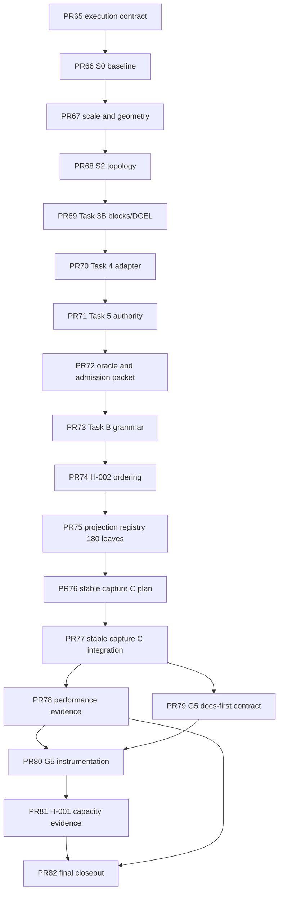

# City Map Re-Architecture PR List

Status: active
Last updated: 2026-07-13

## Execution Contract

- Python 3.12 and NumPy remain the deterministic authority.
- `RoadNetworkCSR` remains the runtime topology authority.
- Road sections enrich static geometry and compile aggregate link properties;
  they do not introduce lane-level microscopic state.
- Static PNG/HTML outputs are diagnostic artifacts, not validation evidence.
- Every PR runs `/review-spec`, `/review-code`, and `/review-drift`; at most
  three finding/fix loops are allowed.
- At most three subagents may be active. Each must be closed immediately after
  its result is consumed. Controller closeout must confirm zero open agents.
- GPL source copying and runtime dependency on external donor folders are
  forbidden without a separate licensing decision.

## PR33 - Source Provenance Boundary

Status: complete.

- Record permitted concepts, excluded upstream surfaces, and license stop gate.
- Correct the claim that CSUR is a city-layout or node-connector generator.
- Runtime behavior must not change.
- Validation: `6 passed` targeted; full repository gate `351 passed`; Ruff and
  `git diff --check` passed after the separately committed routing-cache fix.
- Commit: `docs(map): define source provenance boundary`.

## PR34 - Typed Road Geometry Contract

Status: complete.

- Add typed centerlines, link-to-geometry assignments, and deterministic
  geometry fingerprints.
- Preserve endpoint-only topology behavior as the default adapter.
- Validation: `10 passed` targeted; full gate `361 passed`; Ruff and diff check
  passed.
- Commit: `feat(map): add typed road geometry contract`.

## PR35 - Centerline Topology Compiler

Status: complete.

- Compile generated links into canonical physical centerlines.
- Add deterministic endpoint anchoring validation and a diagnostic interior
  intersection audit. PR40 owns the fail-closed planar-intersection gate after
  node compilation; PR35 does not promote this diagnostic to validation.
- Migrate legacy `csur_module_*` diagnostic keys to project-owned
  `road_hierarchy_module_*` names with documented artifact impact.
- Expose `sidecar_local_fabric` through an explicit city-generation config,
  but keep the current standard mode as default until gates pass.
- Validation: `34 passed` focused review suite; full gate `372 passed`; Ruff
  and diff check passed.
- Commit: `feat(map): compile generated centerlines`.

## PR36 - Road Section Grammar

Status: complete.

- Replace placeholder lane grammar with project-authored unit, section-end,
  and base/shift/transition/ramp contracts.
- Enforce directional one-lane deltas and ordered unit continuity: transition
  permits one lane edit; ramp permits one adjacent lane+channel edit.
- Reject coercive numeric/boolean inputs and separate structural from identity
  profile fingerprints.
- Add canonical profile fingerprints and fail-closed validation.
- Validation: `25 passed` focused review suite; full gate `388 passed`; Ruff
  and diff check passed.
- Commit: `feat(map): add road section grammar`.

## PR37 - Section And Node Compiler

Status: complete.

- Assign profiles from road hierarchy and compile aggregate lanes/capacity.
- Compile node through continuity, turn-pocket eligibility, non-through movement count,
  and signal eligibility without lane-level simulation.
- Validation: `7 passed` targeted; public records reject coercive inputs and
  preserve deep immutability; full repository, Ruff, and diff gates passed.
- Commit: `feat(map): compile sections and nodes`.

## PR38 - Static Ribbon Renderer

Status: complete.

- Render centerline polylines as width-aware road ribbons with optional median,
  shoulder, ramp, repair-link, and bridge layers.
- Add roads-only, zones-only, and POIs-only diagnostic outputs.
- Validation: `11 passed` targeted; uniform meter projection, rendered-catalog
  provenance, layer availability, legacy fallback, and component focus covered;
  visual audit remains diagnostic only.
- Commit: `feat(ui): render typed road geometry`.

## PR39 - OSM Reference Import

Status: complete.

- Add offline normalized OSM XML import as optional development tooling.
- Project, clip, split shared-node intersections, simplify, and classify ways.
- Runtime must not fetch network data or require OSM dependencies.
- Validation: `12 passed` targeted; source identity, lane semantics, closed
  roundabouts, implicit motorway direction, antimeridian projection, exact
  input provenance, and fresh-process import firewall covered.
- Commit: `feat(map): add offline osm centerlines`.

## PR40 - Validation Closure

Status: complete.

- Gate deterministic fingerprints, weak connectivity, intersection validity,
  random OD reachability, section continuity, and replay compatibility.
- Regenerate diagnostic map artifacts and record remaining visual limitations.
- Admission: explicit `sidecar_local_fabric_planar` only. Default promotion was
  rejected after a material suite-time regression and route-ID breakage.
- Validation: full repository `426 passed`; focused closure/planar/geometry
  `23 passed`; Ruff and diff checks passed; final PNG bundle visually audited.
- Commit: `test(map): close city map validation gates`.

## Hardware-Fit Boundary

- Keep orchestration and contracts in Python.
- Keep baseline geometry arrays and field calculations in NumPy.
- Consider Rust only after spatial splitting, planarization, or graph-search
  stages are measured as material CPU/control-flow costs.
- Consider JAX/GPU only for measured dense morphology-field or batched scoring
  work, with compile and steady-state timing separated.
- Do not add C++/CUDA, PyTorch, or new runtime backend names in this roadmap.

## PR41 - Urban Morphology Diversity

Status: complete.

- Add reference-only empirical city metrics from peer-reviewed OSM analysis.
- Add physical-centerline orientation, circuity, grain, and connectivity metrics.
- Make existing style IDs select distinct grid, multi-grid, polycentric,
  corridor-constrained, organic, and legacy radial grammars.
- Preserve scenario-resolved `auto` defaults and explicit planar acceptance.
- Generate a six-style comparison atlas and record limitations without city
  replication claims.
- Validation: `13 passed` feature tests; full repository `439 passed`; Ruff and
  diff checks passed; PNG contact sheet visually audited.

## PR42 - Block Continuity And Density Envelope

Status: complete.

- Measure occupied-area street density, block continuity, connector/local
  length ratio, intersection-type mix, and district quadrant presence across
  seeds.
- Reduce excess four-way share in polycentric/mixed styles and excess dead ends
  in corridor styles without fitting named cities.
- Three-seed evidence: polycentric four-way median `0.656 -> 0.603`, mixed
  `0.630 -> 0.587`; river dead-end median `0.324 -> 0.119` and block
  continuity `0.637 -> 0.882`.
- The v1 gate is intentionally scoped to connectivity, density, and
  intersection mix. It does not validate continuous citywide fabric.
- Validation: targeted morphology/static suite `49 passed`; full repository
  `472 passed`; Ruff and diff checks passed; independent finding/fix re-review
  closed all reported issues.

## PR43 - Continuous Fabric Coverage

Status: complete.

- Add a deterministic global spatial-coverage measure that can distinguish
  continuous street fabric from dense but isolated district patches.
- Replace long bare inter-district connectors with style-aware corridor infill
  or a continuous global lattice where the morphology calls for it.
- Preserve style diversity, planar/OD gates, and project-owned broad
  thresholds; do not fit named cities.
- Defer morphology-aware zone/POI placement until this gate passes.
- Pre-change local cell-presence medians ranged from `0.152` to `0.342` for
  non-grid local fabrics; the synthetic continuous lattice scores `0.498` and
  the comparable-length precinct-island fixture is materially lower.
- Gate v2 adds a project-owned `0.40` minimum after style-aware infill while
  retaining all PR42 thresholds.
- A visual-review counterexample showed that long lines can game cell
  presence, so v2 also requires `0.40` local-junction proximity on a 12 by 12
  raster with a `0.5` cell-diagonal radius.
- Three-seed local-presence medians improved: ring `0.172 -> 0.618`, grid
  `0.309 -> 0.759`, polycentric `0.338 -> 0.483`, river `0.342 -> 0.625`,
  mixed `0.267 -> 0.615`, organic `0.152 -> 0.491`.
- Validation: focused city suite `67 passed`; full repository `479 passed`;
  Ruff and diff checks passed; independent finding/fix re-review closed all
  four findings.

## PR44 - Morphology-Gated Zone And POI Coupling

Status: complete; legacy remains the default and morphology placement remains
fail-closed behind the recomputed v2 gate.

- Keep legacy placement as the default and deterministic fallback.
- Admit morphology-aware placement only from a versioned accepted gate.
- Use synthetic district/subcenter context, never empirical named-city fitting
  or external runtime data.

## Realistic Synthetic City Queue

The controlling product contract is
`docs/PRD_REALISTIC_SYNTHETIC_CITY.md`. PR53-PR64 replace further schematic
sidecar refinement with a terrain-to-block-to-runtime pipeline. Existing
PR33-PR45 evidence remains the compatibility and negative-control baseline.

Status: closed as `BLOCKED`; the explicit realistic path remains available,
but `standard` remains the default pending a new generator redesign spec.

- **PR53 - Product Contract Freeze:** complete; froze thresholds, public
  contracts, claim boundary, and ordered queue. Commit:
  `docs(city): define realistic synthetic city target`.
- **PR54 - Generator Boundary Extraction:** complete; preserved current fingerprints while
  isolating compatibility, typed stage, and finalization boundaries. Commit:
  `refactor(city): isolate generation stage contracts`.
- **PR55 - Terrain And Development Fields:** complete; bounded read-only NumPy fields and
  deterministic centers. Commit: `feat(city): add terrain and development fields`.
- **PR56 - Hierarchical Street Skeleton:** complete; terrain-aware gateways, arterial
  connectivity, and bounded redundancy. Commit:
  `feat(city): generate hierarchical street skeleton`.
- **PR57 - Continuous Local Fabric:** complete; orientation-field local growth and
  collector coupling. Commit: `feat(city): grow continuous local street fabric`.
- **PR58 - Planar Block Compiler:** complete; same-layer T-junction splitting,
  proper-crossing planarization, short-fragment contraction, simple bounded-face
  extraction, and source-street frontage gates pass the 6-style by 4-seed
  matrix. Validation: targeted `29 passed`; full repository `691 passed`;
  Ruff and diff checks passed. Commit:
  `feat(city): compile planar urban blocks`.
- **PR59 - Block Land Use And POIs:** complete; immutable block assignments use
  terrain, center proximity, slope, and road hierarchy; explicit per-hectare
  capacities, frontage access nodes, industrial buffers, and essential POIs
  pass the 6-style by 4-seed matrix. Validation: targeted `27 passed`; full
  repository `718 passed`; Ruff and diff checks passed. Commit:
  `feat(city): couple land use to urban blocks`.
- **PR60 - Simulation Map Compiler:** complete; explicit paired config,
  composed blueprint, no-repair topology/CSR/zoning compiler, 512 sampled OD
  gate, replay fingerprints, runtime initialization, and polygon static-map
  payload pass the 6-style by 4-seed matrix. Validation: targeted `32 passed`;
  related integration `99 passed`; full repository `747 passed`; Ruff and diff
  checks passed. Commit:
  `feat(city): compile realistic map runtime authority`.
- **PR61 - Physical Link Traversal:** complete; preserved the default point
  queue while adding explicit NumPy length/speed residency, finite lane-length
  storage, exit-ready demand, source/downstream spillback, replay/UI/benchmark
  provenance, and finite-storage invariants. Validation: targeted `12 passed`;
  related runtime/UI/backend `135 passed`; full repository `759 passed`; fresh
  import firewall, Ruff, and diff checks passed. Commit:
  `feat(sim): add physical link traversal`.
- **PR62 - Empirical Plausibility Audit:** complete as an audit surface and
  fail-closed as a product gate. The fixed 30-map matrix generated successfully
  but `0/30` maps passed: all exceed the empirical mean-degree/dead-end envelope
  and seven exceed the 800 m developed branch-free corridor gate. Diagnostic
  contact-sheet review independently confirms a universal triangular lattice,
  repeated block areas, zero collector share, and weak terrain response.
  Thresholds were not changed. Validation: targeted `8 passed`; canonical
  audit generated all 30 maps in `144.26 s` at `272,112 KiB` maximum RSS;
  full repository `767 passed`; Ruff and diff checks passed. Commit:
  `test(city): audit synthetic city plausibility`.
- **PR63 - Scale And Hardware-Fit Closure:** complete as a fresh-process
  diagnostic and fail-closed as a performance/product gate. The canonical
  42-run matrix covers three populations, three seeds, both city modes, three
  realistic stage profiles, and six paired-budget runs. At 100k every seed
  fails generation wall (`2.55-2.77x`), actual citizen realization
  (`61,655-62,604` realistic and `62,500` legacy), and paired throughput
  (`16-17` realistic ticks versus `20-21` legacy). RSS and fixed 20-tick
  latency ratios pass. No eligible generation stage reaches 30 percent on all
  seeds, so no Rust generation probe is admitted. Canonical artifact:
  `artifacts/runtime_spine_review/realistic-city-pr63-scale.md`. Commit:
  `perf(city): close realistic map scale gate`.
- **PR64 - Default Promotion:** closed as `BLOCKED`; PR62 and PR63 source
  fingerprints reload successfully, but their conjunctive gates fail.
  `standard` remains the default and the planned feature commit
  `feat(city): promote realistic generator default` is forbidden. Decision:
  `docs/harness/REALISTIC_CITY_DEFAULT_PROMOTION_DECISION.md`. Closure commit:
  `docs(city): record realistic promotion blocker`.

## Scalable Map Breakthrough Execution DAG (PR65-PR82)

Status: `PR65_DOCS_ONLY`; every later node is `NOT_AUTHORIZED` unless its
listed predecessor is frozen-head green and its required review and watchdog
findings are zero. This is an execution-contract record for the user-approved
2026-08-10 DAG, not implementation, readiness, validation, or traffic-model
authority.

### Global Execution Constraints

Each node must base on the latest merge of
`origin/008-routing-runtime-integration`. The dirty primary checkout remains
read-only; every node uses a mandatory isolated worktree. A prior PR65 base or
receipt is not permission to reuse a stale base for a later node.

PR73, PR74, and PR75 are serial. Task C and G5 same-file owners are also
serial; no parallel branch may edit a shared owner. The only nodes permitted to
run 1M/resource gates are PR78, PR80, and PR81. PR74 uses bounded focused
checks only; its deterministic parity checks do not open a 1M/resource gate.

### Canonical Mermaid DAG



### PR65 Boundary

PR65 documents this DAG and its review/watchdog/M1 contract in existing
harness documents only. It does **not** authorize Task B, Task C, G5,
performance work, readiness work, or any traffic-algorithm PR. It changes no
source, tests, tools, CI, manifest, ledger, API, default, unit, cache,
replay, fallback, or threshold.

### Node Queue

- **PR65 — Execution contract:** `PR65_DOCS_ONLY`; record this DAG and the
  frozen-review rules. No implementation authority is created.
- **PR66 — S0 baseline:** `NOT_AUTHORIZED`; import only the required
  null-operator source, tests, and JSON manifest after PR65 closes.
- **PR67 — Scale and geometry prerequisites:** `NOT_AUTHORIZED`; import the
  CityScaleSpec/v2 configuration and the growth-geometry fixed-point repair as
  separate commits with separate focused gates.
- **PR68 — Task 3 S2 topology:** `NOT_AUTHORIZED`; import reviewed topology
  source/tests and revalidate the current seal.
- **PR69 — Task 3B blocks/DCEL:** `NOT_AUTHORIZED`; import blocks/DCEL and
  lazy exports while preserving the recorded performance failure.
- **PR70 — Task 4 adapter:** `NOT_AUTHORIZED`; import the compiler adapter and
  its import-isolation correction.
- **PR71 — Task 5 authority:** `NOT_AUTHORIZED`; import the static-authority
  candidate and obtain final independent review.
- **PR72 — Oracle and admission packet:** `NOT_AUTHORIZED`; import the
  preoptimization oracle/controller/manifest and reviewed immutable Task B
  manifest/vector packet, then verify it in a clean clone.
- **PR73 — Task B grammar:** `NOT_AUTHORIZED`; clean-room exact records and
  canonical scalar/dataclass/enum/mapping grammar. The frozen Task B line caps
  are **1,922** and **4,423**; crossing either cap is
  `BLOCKED_SCOPE_SPLIT`, not a reason to compress or widen scope silently.
- **PR74 — H-002 ordering:** `NOT_AUTHORIZED`; implement normalized-value
  ordering with deterministic parity and bounded focused checks only; 1M and
  resource gates remain reserved for PR78, PR80, and PR81.
- **PR75 — Projection, registry, and 180 leaves:** `NOT_AUTHORIZED`; implement
  CSR/deep projection P, linearizable registry R, and the six-style oracle.
- **PR76 — Stable capture C plan:** `NOT_AUTHORIZED`; freeze and independently
  review the current-hash Task 4/5 integration plan.
- **PR77 — Stable capture C integration:** `NOT_AUTHORIZED`; implement receipt
  registration, Task 4 admission, and Task 5 stable capture.
- **PR78 — Performance evidence:** `NOT_AUTHORIZED`; run official isolated RSS
  and separate wall gates twice, plus H-006 no-op.
- **PR79 — G5 docs-first contract:** `NOT_AUTHORIZED`; freeze ownership,
  byte/count grammar, and failure-prefix state before code.
- **PR80 — G5 instrumentation:** `NOT_AUTHORIZED`; implement phase
  instrumentation and rerun the PR78 resource gate.
- **PR81 — H-001 capacity evidence:** `NOT_AUTHORIZED`; measure exclusive
  Task 3B capacity on final G5 source without production changes, then stop
  exploration at the frozen bound.
- **PR82 — Final closeout:** `NOT_AUTHORIZED`; record seven independent
  verdicts. If any predecessor is blocked, the only permitted closeout is an
  honest docs-only `BLOCKED` closeout; it must not claim successor success.

### Frozen Review And Merge Contract

Every DAG PR must expose a frozen PR body containing: PR number and scope;
base SHA; frozen head SHA; parent receipt; allowed files **and symbols**;
forbidden scope; acceptance commands; code/process/claim budgets; falsifier;
predecessor and dependency state; exact command receipts; review-round count
and findings; watchdog verdicts; one M1 Decision Card; declared artifacts; and
an explicit authorization boundary. These fields are evidence labels, not
implementation or readiness claims.

The required review surfaces are:

1. `/review-spec` — verify scope, dependencies, contracts, and forbidden
   authority claims.
2. `/review-code` — verify the frozen diff against the allowed paths and
   stated behavior.
3. `/review-drift` — verify no unreviewed expansion of process, claims, or
   implementation has entered the node.

The four mandatory watchdogs are:

- **Drift watchdog:** rejects unallowed files, API, default, unit, cache,
  replay, fallback, or threshold changes; stale parent seals; and false-RED
  reclassification.
- **Code-inflation watchdog:** rejects unapproved symbols, modules,
  dependencies, config, or backends; speculative helpers; and dead scaffolds.
  Task B totals may not exceed 1,922 source lines or 4,423 test lines.
- **Process-accretion watchdog:** rejects scripts, jobs, ledgers, reports, or
  manifests without a consumer and retirement condition, and repeated
  shared-ledger mutation.
- **Claim-accretion watchdog:** rejects smoke-to-validation,
  implementation-to-readiness, and partial-to-aggregate/transitive promotion.
  Every numerical claim binds candidate SHA + exact command + artifact.

One review round has this exact sequence: `/review-spec` → `/review-code` →
`/review-drift` → four watchdogs → one bounded fix batch → targeted gate and
frozen-head CI → same-finding closure. Each round posts a new immutable
`REVIEW_RECEIPT/Rn` PR comment. At most three rounds are allowed. After round
three, any finding yields `BLOCKED_REVIEW_LIMIT`; if a finding requires new
scope, split rather than stretch the node and stop as `BLOCKED_SCOPE_SPLIT`.

A merge is permitted only when the **same frozen head** has green CI, all
acceptance gates and watchdogs green, zero findings, zero open subagents, and
green predecessor gates. Merge with a merge commit that preserves internal TDD
commits; force-push is forbidden after review. No tracked change may follow the
frozen-head review. Review and watchdog evidence do not themselves authorize an
unlisted successor.

### M1 Decision Cards

Each executed PR has exactly one M1 Decision Card. `meta_depth: 1` means one
bounded decision about the next observable action. M1 is not correctness,
readiness, validation, performance, or claim evidence. Any attempt to add
another meta-level is `META_RECURSION_BLOCKED`; immediately return to the
card's listed productive action and produce its observable output.

#### M1 Decision Card — PR65

```text
meta_depth: 1
Question: What is the smallest observable change that safely opens this DAG?
Evidence: Remote base is green and lacks the scalable foundation; two existing
  harness documents already own roadmap and acceleration guardrails.
Inference: A two-file docs-only contract is sufficient for PR65.
Counterevidence checked: No new script, CI, ledger, implementation, or traffic
  authority is needed.
Decision: Modify only the two allowed documents.
Falsifier: Any tracked path outside the allowlist or any readiness/traffic claim.
Observable output: DIFF
Next action: implement
```

#### Reusable M1 Template (not an instantiated card)

```text
meta_depth: 1
Question:
Evidence:
Inference:
Counterevidence checked:
Decision:
Falsifier:
Observable output: TEST | BENCHMARK | DIFF | DECISION | BLOCKER
Next action:
```

Each future PR creates its one M1 Decision Card only when that PR is executed
under its own authorization. No future-node card exists now; `NOT_AUTHORIZED`
is preserved until the applicable predecessor and review gates are satisfied.
