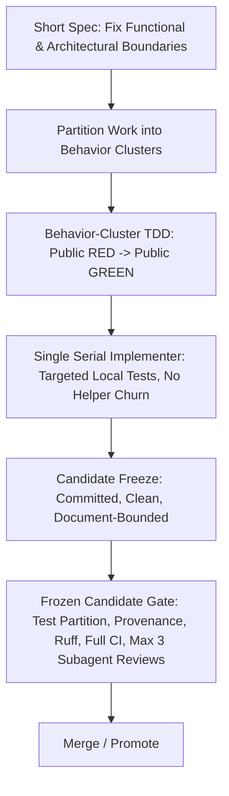

# Process Inflation Decision Guardrails

Status: active
Last updated: 2026-08-23

This document controls development methodology, gate scoping, assurance document
boundaries, and subagent review governance across the repository. It directly
remediates the process inflation, gate inflation, assurance inflation, and commit
churn diagnosed during campaign audits.

---

## 1. Problem Diagnosis & Antipatterns

Audits of campaign cycles identified that development delays stem primarily from
**excessive subdivision of assurance procedures** rather than raw implementation
complexity:

1. **Pre-implementation contract overhead**: Up to ~72% (e.g., 123 min of 171 min)
   spent in upfront contracting and redundant review rounds before code execution.
2. **Helper-level commit churn**: Rapid micro-commits for private helper functions
   and repetitive trial/revert cycles (e.g., 79 commits in 48 min with 5 implement-revert
   pairs accounting for 57.45% of churn).
3. **Assurance document explosion**: Assurance and proposal documentation ballooning
   beyond the size of the production codebase under test (e.g., PR88 core assurance
   doc reaching 5,614 lines vs 4,323 lines of source+test).
4. **Premature downstream assurance**: Generating extensive review/assurance
   documentation for child PRs (e.g., PR89 generating 2,992 lines) before the parent
   PR (e.g., PR88) is even completed or merged.
5. **Gate inflation**: Running entire test suites or formal multi-perspective gate
   evaluations after every private internal helper edit rather than at candidate
   freeze boundaries.

---

## 2. Watchdog Governance Rubric

All development cycles and PRs are monitored against six watchdog dimensions:

| Dimension | Standard / Target | Failure Mode |
|---|---|---|
| **Drift** | Strict boundary to assigned files; committed candidate state | Uncommitted work or scope leakage across unrelated modules |
| **Code Inflation** | Strict line-count upper bounds, zero unapproved symbols, binding budgets | Symbol bloat, unnecessary abstractions, binding exhaustion |
| **Process Accretion** | Campaign-level procedural efficiency; lean operational footprint | Procedural expansion where assurance cost exceeds implementation cost |
| **Claim Accretion / Inflation** | Claim ledger firewall: no 1M, performance, or readiness promotion without proof | Unearned claim promotions or treating diagnostics as validation |
| **Gate Inflation** | Fast targeted test feedback during inner loops; formal gates on frozen candidate | Full suite repetition per private helper; over-gated micro-steps |
| **Assurance Inflation** | Compact, bounded assurance artifacts (< source+test surface); sequential PR prep | Oversized assurance documents; premature downstream PR reviews |

### 2.1 Personal-research threat-model boundary

MetroFlow is personal research code operated by its sole developer. Multi-user
authentication or authorization, malicious-operator defenses, anti-tamper/signing
infrastructure, secret-management frameworks, and product security hardening are
out of scope unless the owner explicitly changes that scope. Checksums, manifests,
and source identities may be retained only as lean reproducibility and accidental-
corruption receipts; they do not establish a security or tamper-resistance claim.
"Adversarial review" means skeptical scientific/code review, not a hostile-actor
threat model. Do not add security gates merely because the project can be audited.

---

## 3. Prescribed Hybrid Methodology

To eliminate process inflation while preserving rigorous quality and deterministic
reproducibility, the repository enforces a **Hybrid Methodology**:

$$\text{Short Spec Boundaries} \longrightarrow \text{Behavior-Cluster TDD} \longrightarrow \text{Single Serial Implementer} \longrightarrow \text{Frozen Candidate Read-Only Subagent Review}$$

### 3.1 Short Spec Boundary Definition
- Specifications must remain concise, defining invariants, public contracts, and
  observable behaviors.
- Assurance and specification documents must **not** exceed the line count of the
  targeted source and test code.

### 3.2 Behavior-Cluster TDD
- Granular tasks are consolidated into cohesive **Behavior Clusters** (e.g., S11,
  S12–13, S14–15, S16–17).
- For each cluster:
  - Write and maintain **public behavior RED** tests establishing the requirement.
  - Implement until **public behavior GREEN** is achieved.
  - **Strictly prohibit** private-helper-level micro-commits and full test suite
    repetition loops during internal helper construction.
  - Run only fast, targeted unit tests during inner development loops.

### 3.3 Single Serial Implementer
- Implementation within an active branch or task cluster is driven by a single serial
  implementer.
- Multi-agent concurrent write storms, competing subagent edits, and speculative
  parallel branch churn are forbidden during the code construction phase.

### 3.4 Frozen Candidate & Read-Only Subagent Review
- Subagent reviews are **read-only** and conducted **only after candidate freeze**.
- A candidate is considered *frozen* when:
  1. All cluster public behavior tests pass;
  2. All working-tree diffs are committed cleanly;
  3. Assurance documents are bounded and accurate.
- Subagent reviews must not perform code edits directly; they provide structured
  audit feedback against the frozen candidate.

### 3.5 Frozen Candidate Gate Protocol
The complete formal gate suite is executed exclusively against the frozen candidate:
1. **Test Partition Gate**: `python tools/ci_test_partition.py --verify` assigns
   every discovered test file to exactly one non-empty CI shard or fails closed.
2. **Provenance Verification**: Validating commits, SHA-256 digests, and manifests.
3. **Ruff & Linter Checks**: Formatting and code quality verification.
4. **Continuous Integration**: Every named test shard plus the oracle and gallery
   jobs passes on the same frozen candidate SHA.
5. **Review Budget**: A maximum of 3 read-only review iterations per frozen candidate.

---

## 4. Cross-PR Sequencing & Downstream Firewall

- **Downstream PR Preparation Block**: Pre-implementation review, upfront contract
  design, and assurance documentation for child PRs (e.g., PR89) are **strictly
  BLOCKED** until the parent PR (e.g., PR88) is merged or structurally closed.
- Speculative downstream assurance generates throwaway documentation that drifts
  when parent implementation evolves.

---

## 5. Single-Evaluation Metacognition & Anti-Recursion

- Metacognitive reflection or methodology self-audit must be performed **exactly once**
  per evaluation cycle.
- The evaluation must immediately reduce to a deterministic, observable output flag:
  `*_METHOD_PILOT=PASS|SPLIT` (e.g., `PR88_METHOD_PILOT=PASS|SPLIT`).
- Re-evaluating the evaluation itself, meta-reasoning about the audit verdict, or
  initiating recursive self-assessment loops is strictly blocked:
  `META_RECURSION_BLOCKED`.
- Once the flag is emitted, execution transitions immediately into concrete
  behavior-cluster implementation.

---

## 6. Active Cluster Map (PR88 Pilot)

| Cluster | Scope | TDD Public Behavior | Gate Execution |
|---|---|---|---|
| **S11** | Scalable authority & topology adapter foundation | Public RED $\to$ GREEN on adapter & authority contracts | Targeted tests; no helper micro-commits |
| **S12–13** | Structural kernel, grade separation & barrier solver | Public RED $\to$ GREEN on bridges, layers & DCEL faces | Targeted tests; no helper micro-commits |
| **S14–15** | Traffic measurement & runtime simulation spine integration | Public RED $\to$ GREEN on tick traversal & token conservation | Targeted tests; no helper micro-commits |
| **S16–17** | Parameter calibration, scale validation & promotion gate | Public RED $\to$ GREEN on scale benchmark & envelope survival | Final frozen candidate test-partition gate & full CI |
